### INDEX

<table>
  <tr>
    <td><a href="./HF릴리스1.0_D01.md">1.릴리스노트</a></td>
    <td><b href="./HF릴리스1.0_D02.md">2.구축및실행</b></td>
    <td><a href="./HF릴리스1.0_D03.md">3.사용가이드</a></td>
    <td><a href="./HF릴리스1.0_D04.md">4.참고용문서</a></td>
    <td><a href="./HF릴리스1.0_D05.md">5.관련리소스</a></td>
  </tr>
</table>

# 2. 플로우그래프 구축 및 실행

- [[하이퍼플로우 핵심 개념]](#하이퍼플로우-핵심-개념-ai-애플리케이션-개발자를-위한-입문-가이드)
- [[플로우그래프(Flow-graph)를 소개]](#플로우그래프flow-graph를-소개)
- [[플로우그래프를 구축하고 실행]](#플로우그래프를-구축하고-실행)

---
## 하이퍼플로우 핵심 개념: AI 애플리케이션 개발자를 위한 입문 가이드
HyperFlow는 AI 애플리케이션의 구축, 배포, 관리를 혁신적으로 바꿔 줄 **노코드/로우코드 플랫폼**입니다.  시각적 프로그래밍의 직관성과 최첨단 AI 기술을 결합하여, 기술자와 비전문가 모두가 손쉽게 고급 AI 애플리케이션을 개발할 수 있도록 지원합니다.

### 왜 하이퍼플로우여야 할까요?

**문제점:** 고도화된 AI 애플리케이션을 구축하려면, 일반적으로 방대한 코딩 지식, 다양한 AI 기술에 대한 깊은 이해, 복잡한 인프라 관리 역량이 요구됩니다.

**해결책:** HyperFlow의 시각적 플로우 그래프 환경은 이러한 복잡함을 제거하고, 사용자가 정말 중요한 일 `현실의 문제를 해결하는 강력한 AI 애플리케이션 개발` 에 집중할 수 있도록 도와줍니다.

### 핵심 개념

### 1. 플로우 그래프 패러다임
HyperFlow의 중심에는 **플로우 그래프**가 있습니다 — AI 애플리케이션의 로직을 시각적으로 표현한 구조입니다.
- **노드(Node)**: 특정 작업을 수행하는 기본 단위입니다 (예: LLM 호출, 데이터 처리 등)
- **엣지(Edge)**: 노드 간 연결로, 실행 흐름(프로세스 플로우)과 데이터 흐름을 모두 나타냅니다
- **파라미터(Parameter)**: 각 노드의 동작을 설정하는 구성 요소입니다
 

HyperFlow의 플로우 그래프 시스템이 특별한 이유:
- **통합형 그래프 구조**: 프로세스 흐름과 데이터 흐름을 하나의 환경에서 통합 관리
- **동적 제어 흐름**: 반복(loop), 분기(branch), 조건 경로 등을 유연하게 표현
- **강한 데이터 타입 지원**: 노드 간 연결 호환성을 보장하고, 지능적인 데이터 처리 가능
- **실행 기록 추적**: 디버깅과 최적화를 위한 전체 실행 이력 저장
 

### 2. 슈퍼 노드와 서비스 아키텍쳐
HyperFlow의 혁신적인 **슈퍼 노드(Super Node)** 아키텍처는 복잡도를 높이지 않고도 구축할 수 있는 범위를 획기적으로 확장시켜줍니다.
- **추상화된 서비스**: 노드는 "어떻게"가 아닌, "무엇을 할 것인가"를 정의합니다
- **다중 구현 지원**: 하나의 노드가 여러 서비스 제공자와 연결될 수 있습니다
- **일관된 인터페이스**: 어떤 구현을 사용하든 입력과 출력 형식은 동일하게 유지됩니다
- **간편한 테스트**: LLM 제공자 등 다양한 서비스를 드롭다운으로 손쉽게 전환하며 테스트할 수 있습니다

예를 들어, **Call LLM** 노드는 OpenAI, Anthropic, Google AI 등 다양한 AI 서비스와 연결할 수 있으며, 플로우 그래프의 구조를 변경할 필요가 없습니다.
 

### 3. 하이퍼파라메트릭스 엔진
HyperFlow의 파라미터 시스템은 단순한 설정을 넘어 훨씬 더 강력한 기능을 제공합니다.
- **인터랙티브 구성**    
    직관적인 파라미터 패널을 통해 노드를 시각적으로 설정할 수 있습니다.
    
- **23가지 파라미터 타입**    
    단순한 드롭다운부터 복잡한 JSON 구조까지 다양하게 지원합니다.
    
- **조건 기반 의존성**    
    선택한 값에 따라 파라미터 항목이 동적으로 나타나거나 변경됩니다.
    
- **이중 모드 파라미터**    
    개발 중에 수동으로 설정하거나, 실행 시 동적으로 제어되도록 연결할 수 있습니다.
    
이 시스템은 빠른 프로토타이핑은 물론, 복잡한 동적 애플리케이션에도 유연하게 대응할 수 있도록 설계되었습니다.
 

### 4. 이중 엔진 아키텍쳐
HyperFlow는 두 가지 특화된 플로우 그래프 실행 엔진을 제공합니다:

- **개발용 엔진** – 생성 및 테스트 단계에서 사용
    - 단일 스텝 실행 및 브레이크포인트 기반의 인터랙티브 디버깅
    - 실시간 파라미터 조정
    - 테스트를 위한 내장 챗봇 시뮬레이터
    - 전체 실행 이력 추적 기능
- **프로덕션용 엔진** – 실제 배포 환경에서 사용
    - 프로덕션 워크로드에 최적화된 성능
    - 외부 제어를 위한 RESTful API 제공
    - 활성 세션을 중단하지 않고도 핫픽스 적용 가능
    - 실행 무결성을 보장하는 Run-Clone 시스템 지원

## 핵심 구성 요소

### LLM 상호작용 노드
- **Call LLM**: 텍스트 생성을 위한 기본 노드로, 다음과 같은 기능을 지원합니다:
    - 텍스트, 이미지, 오디오, 비디오를 포함한 멀티모달 처리
    - LLM 제공자 동적 선택
    - 고급 프롬프트 엔지니어링
    - 지식 주입 및 참조 추적 기능
- **‘Call LLM with Tools’ 노드**:    
    도구 기반 LLM을 위한 특수 노드로, 복잡한 에이전트형 워크플로우를 구현할 수 있습니다.
    

### 콘텐츠 처리

- **Import Content (콘텐츠 가져오기 노드)**    
    문서, 웹사이트, 데이터를 애플리케이션으로 가져옵니다.
    
- **Transform Content (콘텐츠 변환 노드)**    
    다양한 변환기를 사용해 콘텐츠를 가공하고 처리합니다.
    
- **Segmentation Nodes (콘텐츠 분할 노드)**    
    지식베이스에 최적화된 형태로 콘텐츠를 분할하며, PDF, HTML, 텍스트 등 형식별 특화 노드를 제공합니다.
    

### 지식베이스 관련 노드

- **Create Embedding Vectors (임베딩 생성 노드)**    
    텍스트를 임베딩 벡터로 변환합니다.
    
- **Create Knowledge DB (지식 DB 생성 노드)**    
    생성된 임베딩을 기반으로 검색 가능한 벡터 지식베이스를 구축합니다.
    
- **Search Knowledge DB (지식 DB 검색 노드)**    
    벡터 지식베이스에서 유사도 기반 검색을 수행합니다.
    
- **Re-rank (순위 재조정 노드)**    
    고급 재정렬 알고리즘을 통해 검색 결과의 정확도를 향상시킵니다.
    

### 데이터 흐름 및 제어 관련 노드

- **Data Transform (데이터 변환 노드)**    
    템플릿 또는 Python 코드를 활용해 데이터를 변환하는 다기능 노드입니다. *(플로우 그래프의 맥가이버 칼!)*
    
- **Match and Branch (매칭 & 메시지 노드)**    
    조건에 따라 분기되는 경로와 의사결정 트리를 구성합니다.
    
- **Loop Controller (루프 제어 노드)**    
    반복이 필요한 작업을 위한 루프 실행 구조를 구현합니다.
    
- **Key-Value Store (키값 저장소 노드)**    
    세션 간에도 유지되는 상태 정보를 저장하고 관리합니다.
    

### 통합 노드

- **URL Access (URL 접근 노드)**    
    웹사이트에서 콘텐츠를 가져옵니다.
    
- **Web Search (웹 검색 노드)**    
    플로우 내에서 웹 검색을 수행할 수 있습니다.
    
- **Python Code (파이선 노드)**
    특수한 작업을 위해 사용자 정의 Python 코드를 실행합니다.
    

## 실전 예제 : RAG 애플리케이션 만들기

앞서 소개한 개념들을 바탕으로, 다음은 **검색 기반 생성(RAG, Retrieval-Augmented Generation)** 애플리케이션을 구축하는 방법입니다:

1. **Import Content** (콘텐츠 가져오기 노드)를 사용해 PDF 문서를 가져옵니다.
2. **Segment PDF (PDF 분할 노드)** 로 문서를 적절한 크기로 분할합니다.
3. **Create Embedding Vectors (임베딩 생성 노드)** 를 통해 임베딩 벡터를 생성합니다.
4. **Create Knowledge DB (지식 DB 생성 노드)** 로 검색 가능한 지식베이스를 구축합니다.
5. 사용자의 질문이 들어오면, **Search Knowledge DB (지식 DB 검색 노드)** 로 관련 정보를 검색합니다.
6. **Re-rank (순위 재조정 노드)** 를 사용해 검색 결과의 관련도를 향상시킵니다.
7. 마지막으로 **Call LLM(LLM 호출 노드)** 을 통해 일관되고 지식이 반영된 응답을 생성합니다.

이 전체 애플리케이션은 **단 한 줄의 코드도 작성하지 않고** 시각적으로 구성할 수 있습니다. (물론, Python으로 더욱 커스터마이징도 가능합니다.)
 

## 하이퍼플로우로 개발 시 장점

- **빠른 개발 속도**     
    몇 주가 걸리던 고급 AI 애플리케이션을 몇 시간 만에 구축할 수 있습니다.
    
- **유연성**    
    애플리케이션을 다시 만들지 않고도 다양한 AI 서비스를 자유롭게 실험할 수 있습니다.
    
- **확장성**    
    단순한 챗봇부터 복잡한 멀티 에이전트 시스템까지 유연하게 대응합니다.
    
- **미래 대응력**    
    새로운 AI 서비스가 출시되어도 기존 애플리케이션에 손쉽게 통합할 수 있습니다.
    
- **높은 접근성**    
    개발자뿐 아니라 비개발자도 함께 참여하고 기여할 수 있습니다.
    

## 시작하기
HyperFlow로 첫 번째 AI 애플리케이션을 만들어볼 볼까요?

1. **인터페이스 탐색하기**    
    에디터, 브라우저, 시뮬레이터 뷰의 구성과 기능을 확인해보세요.
    
2. **프로젝트 생성하기**    
    조직 계정에서 새 프로젝트를 생성하세요.
    
3. **API 키 설정하기**    
    API 구성 섹션에서 사용할 AI 서비스의 API 키를 추가하세요.
    
4. **플로우 만들기 시작**    
    캔버스에 노드를 끌어다 놓고 연결하여 플로우를 구성하세요.
    
5. **테스트 및 개선**    
    시뮬레이터를 사용해 애플리케이션을 테스트하고 반복적으로 개선하세요.
 

## 플로우 그래프 설계를 위한 핵심 원칙

- **단순하게 시작하기**    
    기본적인 플로우부터 시작해 단계적으로 확장해보세요.
    
- **자주 테스트하기**    
    빌드 중에도 시뮬레이터를 활용해 플로우를 수시로 테스트하세요.
    
- **자유롭게 실험하기**    
    다양한 서비스를 손쉽게 교체하며 결과를 비교해보세요.
    
- **모듈화하기**    
    복잡한 작업은 하위 플로우로 나누어 관리하기 쉽게 만드세요.
    
- **실행 이력 확인하기**
    
    실행 기록을 분석해 플로우의 동작을 이해하고 최적화하세요.
    

## 고급 기능 살펴보기

HyperFlow의 핵심 개념에 익숙해졌다면, 이제 다음과 같은 고급 기능들을 활용해보세요:

- **Python 변환 기능**    
    사용자 정의 코드를 통해 플로우를 확장할 수 있습니다.
    
- **에이전트 기반 시스템**    
    도구를 활용하는 LLM을 활용해 멀티 에이전트 워크플로우를 구성할 수 있습니다.
    
- **복잡한 의사결정 트리**    
    정교한 조건 분기 로직을 구현할 수 있습니다.
    
- **상태 유지형 애플리케이션**    
    세션 간에도 대화 맥락을 유지하는 애플리케이션을 만들 수 있습니다.
    
- **멀티모달 애플리케이션**    
    텍스트, 이미지, 오디오, 비디오 처리를 결합한 복합형 앱을 구성할 수 있습니다.
    

## 맺음말

HyperFlow는 AI 애플리케이션 개발 방식에 근본적인 전환을 가져옵니다. 이제 누구나 더 쉽고, 유연하며, 강력한 방식으로 AI 서비스를 구축할 수 있습니다. 이 문서를 통해 핵심 개념을 이해하셨다면, 이제 치세대의 AI 애플리케이션을 만들어갈 준비를 마치셨습니다.

이제 실습을 통해 하이퍼플로우를 직접 경험해보세요

 

[[TOP]](#index)

---
## 플로우그래프(Flow-graph)를 소개

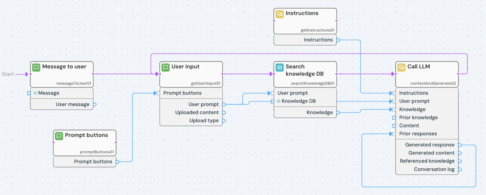

## 플로우 그래프란

이번엔 **HyperFlow 개발 플랫폼**의 기본 개발 요소인 **플로우 그래프**를 소개하도록 하겠습니다.

HyperFlow는 시각적으로 로직을 설계하여 AI 애플리케이션과 워크플로우를 만드는 **노코드 환경**을 제공합니다. 코드 작성 없이 애플리케이션의 프로세스를 나타내는 **플로우 그래프**를 함께 살펴보겠습니다. HyperFlow 개발 환경은 이러한 시각적 표현을 구현하고 이를 실행하면서 실시간으로 함께 개선하는 할 수 있도록 구축되었습니다.

플로우 그래프는 HyperFlow에서 애플리케이션을 구축하는 거의 모든 상황에 사용됩니다. 챗봇 개발, 지식 베이스용 콘텐츠 가져오기 및 처리, 외부 서비스와의 통합, 여러 AI 모델이 협업하는 에이전트 워크플로우 설정, HyperFlow의 제어 및 API 플러그인 시스템을 통한 여러 독립적인 서비스 조율 등에 사용할 수 있습니다. HyperFlow는 이러한 플로우 그래프 기반 시스템을 제공하여, 복잡한 복합 AI 시스템 구축을 쉽게 구현 할 수 있는 훌륭한 허브가 되고자 합니다.

## 플로우 그래프 예제

플로우 그래프에 대한 이해를 돕기 위해, 먼저 첫 프로젝트와 함께 자동으로 설치되는 예제들을 살펴보겠습니다. 예제들은 개발 환경 왼쪽의 **플로우 그래프 디렉토리**에 위치해 있습니다. 이 디렉토리는 현재 프로젝트 내의 모든 플로우 그래프를 보여줍니다. "Examples" 태그 아래에 그룹화된 예제들은 6-7개의 서로 다른 워크플로우를 보여주며, 다양한 응용 사례를 제시합니다. 각각의 목적과 구조를 설명과 함께 살펴봅시다.
 

---
### **예제 1:  단순 원샷(One-shot) 챗봇**

원하는 플로우 그래프를 디렉토리에서 선택하면, 그래프가 에디터에 나타납니다. 가장 기본적인 플로우 그래프인 단순 원샷 챗봇부터 살펴보겠습니다.
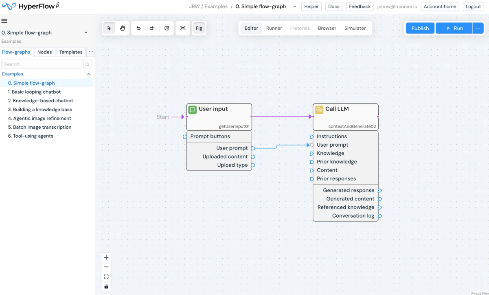

이 플로우 그래프에는 **노드**라고 불리는 두 개의 구성 요소만 있습니다. 각 노드는 워크플로우의 특정 단계로, 첫 번째 노드가 실행된 후 두 번째 노드가 실행됩니다. **보라색 선**은 실행 순서를 보여주며 **프로세스 흐름**을 정의합니다. **파란색 선**은 **데이터 흐름**을 보여주며 노드 간 데이터 이동 방식을 정의합니다.

이 플로우 그래프에서 첫 번째 노드는 프롬프트나 쿼리와 같은 사용자 입력을 요청합니다. 보라색 선은 그 다음 흐름을 두 번째 노드인 **대규모 언어 모델(LLM)** 호출로 진행합니다. 노드 사이의 파란색 선은 사용자 입력이 LLM으로 전달되는 것을 보여줍니다. LLM은 프롬프트를 처리하고 응답을 생성한 후 이를 표시합니다.

이 두 노드 구조는 "원샷" 챗봇을 만듭니다. 사용자가 입력을 제공하면 LLM이 단일 응답을 생성합니다

이를 바탕으로 다음 예제들인 루핑(looping) 챗봇과 지식 기반 챗봇을 살펴보도록 하겠습니다. 
 

---
### **예제 2: 루핑(Looping) 챗봇**

원샷 챗봇을 기반으로 **루핑 챗봇**을 구현하면 더욱 동적인 상호작용이 가능한 챗봇을 만들 수 있습니다.
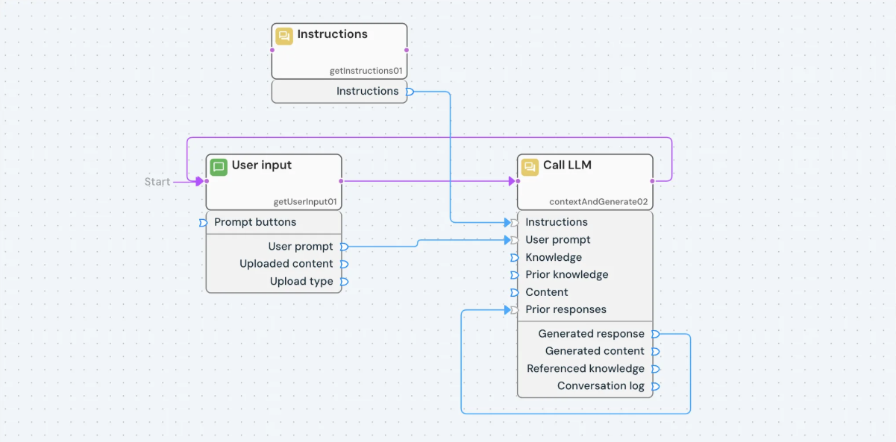

앞선 예제1과 비교 시, 예제2의 플로우 그래프에는 중요한 부분이 추가되어있습니다: 보라색 선으로 표시되는 프로세스 흐름이 이제 LLM 호출 후에 다시 루프백됩니다. 이 루프는 ChatGPT나 Gemini에서 동작하는 챗봇처럼, 지속적인 대화를 가능하게 합니다.

루프 외에 다른 노드도 추가되었습니다. 가장 위에 보이는 새로운 노드는 LLM 호출에 **지시사항**을 입력 할 수 있게 합니다. 이러한 지시사항은 LLM이 사용자 요청에 어떻게 행동하고 응답해야 하는지 안내하며, 이는 일반적으로 "프롬프트 엔지니어링"이라고 불리는 중요한 측면입니다.

또한 데이터 흐름 루프가 추가되어 LLM의 응답을 다시 `이전 응답` 입력으로 피드백합니다. 이는, LLM이 일반적으로 장기 기억력이 없기 때문에, 앞선 대화의 내용을 기반으로 대화 하기 위해선 필수로 추가해야 합니다. 문맥을 유지하기 위해 애플리케이션은 대화 기록을 유지하고 각 실행 기록을 LLM에 전달해야 합니다. 이를 통해 LLM에 필요한 대화 문맥을 제공합니다.
 

---
### **예제 3: 지식 기반 챗봇**

이번 예제는 특정 정보를 기반으로 문맥적으로 관련된 응답을 제공하기 위해 지식 베이스를 활용할 수 있는 챗봇을 만드는 방법을 다룹니다.
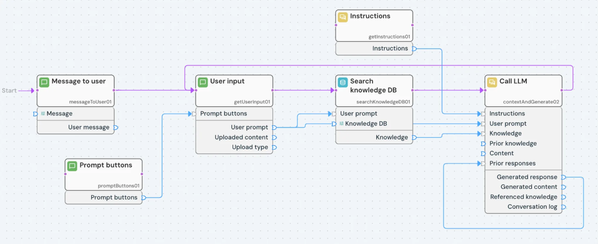

이러한 유형의 챗봇을 일반적으로 **검색 증강 생성(RAG)** 챗봇이라고 합니다. 핵심 구조는 이전 예제의 사용자 입력, LLM 호출, 지시사항 노드를 유지하되, 중요한 추가사항인 **지식 DB 검색** 노드가 추가되는 것입니다. 파란색 데이터 흐름 선에서 볼 수 있듯 사용자의 프롬프트는 이제 이 새로운 노드와 메인 LLM 호출 노드 모두에 전달됩니다.

지식 베이스 검색 노드는 사용자의 프롬프트를 기반으로, 미리 구축된 지식 베이스에서 관련 정보를 검색합니다. 검색된 지식은 LLM 호출 노드의 `지식` 입력으로 연결되어 주입됩니다. 이 프로세스는 사용자의 쿼리에 특화된 도메인 지식으로 LLM의 응답을 생성할 때 효과적입니다. 사용자의 초기 쿼리에 대한 응답을 생성할 때 LLM은 이 검색된 지식을 활용하도록 지시받습니다.

여기서 두 개의 노드가 더 추가됩니다. 첫 번째인 **사용자에게 메시지**는 사용자에게 시작 메시지를 보내는 노드입니다. 메인 루프 밖에 위치하기 때문에 이 메시지는 대화를 시작하는 소개 메시지로 처음 한 번만 전송됩니다. 두 번째 추가사항은 **프롬프트 버튼** 노드입니다. 이를 통해 사용자가 선택할 수 있는 초기 추천 또는 제안 프롬프트 세트를 지정할 수 있어, 특히 도메인 특화 또는 지식 기반 챗봇에서는 더욱 사용자 친화적인 경험을 제공합니다.

이러한 지식 기반 챗봇 플로우 그래프는 HyperFlow가 외부 지식을 활용하여 양질의 응답 생성하고 더욱 편리한 사용자 경험을 제공하는 정교한 챗봇을 만들 수 있는 능력을 보내줍니다.
 

---
### **예제 4: 지식 베이스 구축**

맞춤형 지식 기반 애플리케이션을 개발하는 데 있어 지식 베이스를 만들고 관리하는 것은 매우 중요합니다. HyperFlow에서는 이를 지원하는 데 필수적인 워크플로우를 만들 수 있습니다. 이번 예제에서는 이러한 지식 베이스를 구축하기 위해 설계된 워크플로우를 살펴봅니다.
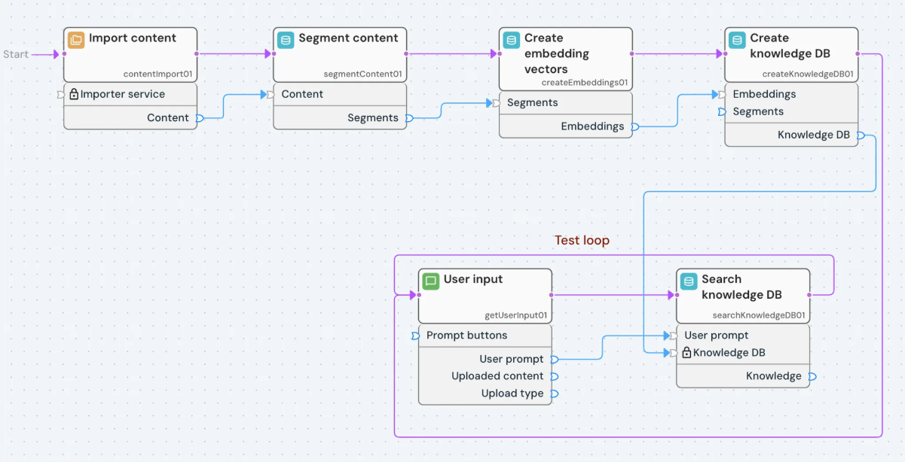

이 플로우 그래프는 1) 콘텐츠 가져오기, 2) 관리 가능한 지식 청크로 나누기, 3) & 4) 검색 가능한 지식 베이스 구축 순서의 워크플로우로 설계하였습니다. 이는 HyperFlow가 단순 대화형 챗봇을 구현하는 것을 넘어서는 워크플로우를 만드는 데 어떻게 사용될 수 있는지 보여주는 좋은 예시입니다.

지식 데이터베이스 구축 플로우의 끝에는 작은 테스트 루프가 포함됩니다. 이 루프에서는 새로 구축된 지식 베이스를 테스트할 수 있습니다. 테스트 루프에서 사용자 프롬프트가 입력되고, 지식 베이스에 대한 검색이 수행되며, 결과가 표시되고 더 많은 테스트 쿼리를 위해 다시 루프백됩니다. 이 테스트 루프를 통해 구축된 지식 베이스의 정확성 및 효과성을 빠르게 확인 해 볼 수 있습니다.

지식 베이스를 구축하고 이를 테스트하는 워크플로우를 살펴봤으며, HyperFlow의 기능이 챗봇 개발에 국한되어있지 않으며 AI 애플리케이션 구축에 필요한 다양한 작업을 지원 할 수 있다는 것을 잘 보여줍니다.
 

---
### **예제 5: 이미지 생성 및 개선을 위한 에이젠틱 워크플로우**

이번엔 앞서 살펴본 챗봇과 지식 데이터베이스와는 조금 다른 유형인, **에이젠틱**  워크플로우를 살펴봅시다. 이 플로우 그래프는 두 개의 대형 언어 모델(LLM)이 협력하여 반복적인 이미지 생성 및 개선과 같은 다소 복잡한 작업을  수행하는지 설명합니다.
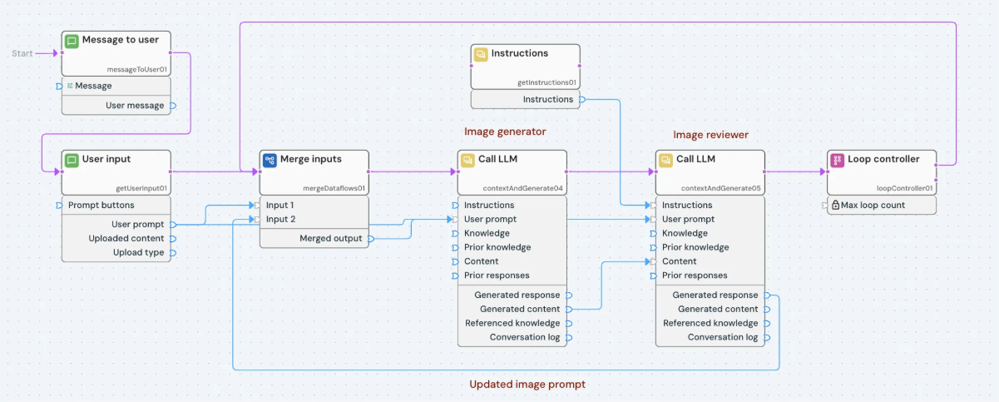

이 플로우그래프의 핵심은 사용자의 요청을 기반으로 이미지를 생성하는 첫 번째 LLM과 그 이미지를 비평하고 개선하는 두 번째 LLM을 사용하는 것입니다. 가장 먼저, 사용자가 원하는 이미지를 설명하는 프롬프트를 제공하는 것으로 시작합니다. 이 프롬프트는 첫 번째 LLM에 전달되며, 이 모델은 DALL-E 3 또는 Stable Diffusion과 같은 이미지 생성이 가능한 모델을 사용합니다. 첫 번째 LLM은 사용자의 프롬프트를 바탕으로 첫 이미지를 생성합니다.

이렇게 생성된 이미지는 두 번째 LLM에 입력으로 전달됩니다. 이 두번째 LLM은, 최초로 생성된 이미지를 원래의 사용자 프롬프트와 함께 비교하여 검토하도록 지시합니다. 만약 이미지가 프롬프트에서 제시된 기준과 완전히 일치하지 않으면, 두 번째 LLM은 사용자의 최초 프롬프트에 더 잘 맞도록 개선된 이미지를 생성할 프롬프트를 다시 작성하는 임무를 맡습니다.

이렇게 다시 작성된 프롬프트는 다시 첫 번째 LLM에 전달되어 피드백 루프를 형성합니다. 첫 번째 LLM은 수정된 프롬프트를 기반으로 새로운 이미지를 생성하며, 이 과정은 반복됩니다. 즉, 사용자가 특정 이미지를 요청하면, 이 에이전틱 시스템은 루프에 들어가며, 매 회 루프가 반복 될 때마다 생성된 이미지를 개선하는 것을 목표로 합니다. 첫 번째 LLM은 이미지 생성기로 수정된 프롬프트에 응답하고, 두 번째 LLM은 비평자로서 이미지를 평가하고 프롬프트 수정을 제안합니다.

이 플로우 그래프는 여러 LLM이 협력하여 각자 특정 역할을 수행하며, 원하는 작업을 달성하는 전형적인 에이전틱 워크플로우를 보여주는 좋은 예시입니다. 이 경우에는 반복적인 개선을 통해 개선된 콘텐츠를 생성하는 플로우 그래프를 살펴보았습니다. 간단한 예시이지만, 여러 AI 에이전트의 협력적인 노력을 통해 복잡한 프로세스를 자동화하는 에이전틱 워크플로우의 강력한 기능을 보여줍니다.
 

---
### **예제 6: 자동화된 콘텐츠 묶음 처리**

이번엔  콘텐츠를 묶음처리하는 플로우그래프를 소개합니다. 이 예시는 HyperFlow가 챗봇 구축에만 제한되어있지 않음을 잘 보여줍니다. 이 유형의 워크플로우는 대규모 데이터를 처리하고 반복적인 작업을 자동화하는 데 유용할 수 있습니다.
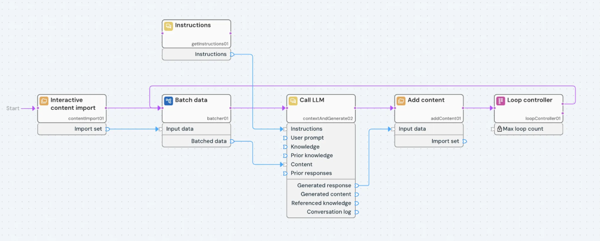

이 플로우그래프를 통해 여러 개의 스캔된 이미지들을 처리해 보고자 합니다. 우선, 이 스캔된 이미지들을 묶음으로 가져오는 것부터 시작하고, 그 후에 각 이미지들은 하나씩 처리됩니다. 이미지를 하나씩 처리하기 위해서는 순차적으로 LLM으로 합니다. LLM은 이미지에 포함된 텍스트를 추출하기 위해 광학 문자 인식(OCR)을 수행하거나, 설명 요약을 생성하거나, 이미지에 손으로 쓴 메모나 다른 형태의 텍스트가 있을 경우 이를 기록할 수 있습니다.

LLM에서 나온 출력물(텍스트, 설명, 또는 기록된 내용)은 이후 ‘콘텐츠 추가’ 노드로 전달되며 이 출력물은 프로젝트의 자산 저장소에 저장됩니다. 이후의 워크플로우는 배치 내에서 다음 이미지 처리를 위해 루프를 돌아가며, 모든 항목이 처리될 때까지 계속됩니다. ‘루프 제어’ 노드는 데이터 묶음처리 노드와 협력하여, 배칭 노드의 입력이 모두 처리되었을 때 루프가 종료됩니다.  

이 플로우그래프는 HyperFlow 내에서 구현된 묶음 처리 루프의 예시로, 콘텐츠 처리 및 관리를 위해 최적화되어 있습니다. 이는 HyperFlow가 인터랙티브 챗봇을 넘어, AI 기술 관련 작업 자동화와 보다 광범위한 AI 애플리케이션 구축을 지원하는 다양한 워크플로우를 만드는 데 활용될 수 있음을 강조합니다.
 

---
### **예제 7: 도구(Tool)를 적용한 LLM을 사용해 챗봇 만들기**

이번 예시는 HyperFlow에서 도구를 활용하여 LLM을 워크플로우에 통합하는 지원 기능을 구현한 예제입니다. 이 기능을 통해 LLM은 외부 도구를 활용하여 기능을 확장하고 더욱 향상된 대답을 도출할 수 있습니다.
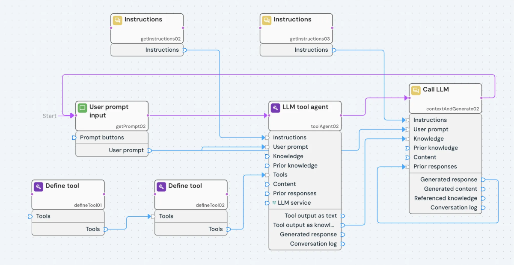

이 플로우그래프에서는 LLM이 사용자 프롬프트를 평가하여 특정 도구의 사용이 도움이 될지 판단할 수 있습니다. 해당 예시는 두 가지의 도구가 정의된 시나리오로, 실시간 날씨 정보를 가져오는 도구와 수학 계산을 수행하는 도구가 있습니다.

LLM은 사용자의 프롬프트를 평가하여, 프롬프트 내용에 더욱 정확하며 관련있는 응답을 제공할 수 있는 도구를 판단합니다. 특정 도구가 적절하다고 판단되면, LLM은 필요한 데이터를 제공하며 LLM 도구 에이전트 노드에 해당 도구 호출을 요청합니다. 예를 들어, 사용자가 특정 지역의 날씨에 대해 문의하면, LLM은 날씨 정보 도구의 관련성을 인식하고, 요청된 위치 정보를 입력으로 전달하여 최신 날씨 데이터를 가져옵니다. 마찬가지로, 프롬프트에 수학적 문제가 포함된 경우, LLM은 계산 도구를 사용해 답을 도출합니다.

도구를 활용하는 LLM을 루핑 챗봇 구조와 통합한 것은 에이전트 기반 AI 애플리케이션의 전형적 사례입니다. 이 예시는 LLM이 외부 기능으로부터 보완받아 그 기능을 확장할 수 있음을 잘 보여줍니다.
 

---
### 결론

이로써 예시 플로우그래프 소개를 마칩니다. 후속 가이드에서 좀 더 자세히 다루겠지만, 살펴본 예시들로 HyperFlow 내에서 구성할 수 있는 다양한 워크플로우와 그 구조를 시각적으로 이해하는 데 도움이 되셨길 바랍니다. 보라색 선은 프로세스 흐름 또는 작업 순서를, 파란색 선은 플로우-그래프 내 서로 다른 노드 간의 데이터 흐름을 나타낸다는 것을 기억해 주세요.

 

[[TOP]](#index)

---
## 플로우그래프를 구축하고 실행

HyperFlow의 개발 환경에서 플로우그래프를 구축하고 실행하는 방법에 대해 알아봅니다.

플로우그래프란, 노드들을 연결하여 구성한 워크플로우의 시각적 표현입니다. 보다 자세한 내용은 플로우 그래프 소개 챕터에서 확인할 수 있습니다.

### 플로우그래프 편집기

**플로우그래프 편집기**란 플로우 그래프를 생성하고 수정하는 주요 작업 공간입니다. HyperFlow 통합 개발 환경(IDE) 내에서 제공되며, 기본 UI 모드 패널에서 "Editor"를 선택하면 접근할 수 있습니다.
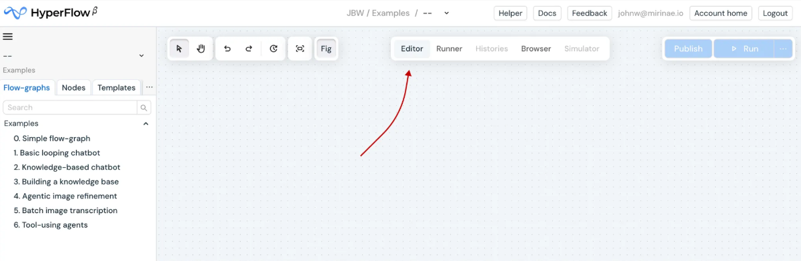
 

### 플로우그래프 생성 및 관리

기존에 생성하였거나 미리 구축된 템플릿 플로우그래프는 좌측 디렉터리 창의 **"Flow-Graphs"** 탭에서 확인할 수 있으며, 목록에서 원하는 플로우 그래프를 선택하면 편집기에 로드됩니다.

새로운 플로우 그래프는 다음 방법으로 생성할 수 있습니다:

1. **복제(Duplicating)** – 타이틀 바 드롭다운 메뉴에서 **"Duplicate"** 기능을 사용하여 기존 플로우 그래프를 복사
2. **클론(Cloning)** – **"Templates"** 탭에서 원하는 템플릿을 선택하여 복제
3. **새로 생성(Creating)** – 메인 드롭다운 메뉴에서 **"New flow-graph"** 기능을 사용하여 처음부터 새롭게 생성

각 방법에 따라 선택하면 플로우 그래프의 이름, 설명, 디렉터리 내 태그 설정, 공개/비공개 여부를 지정할 수 있는 대화창이 열립니다. 이후에는 **"Flow-Graphs"** 드롭다운 메뉴에서 **"Edit Details"**를 선택하여 세부 정보를 수정할 수 있습니다.
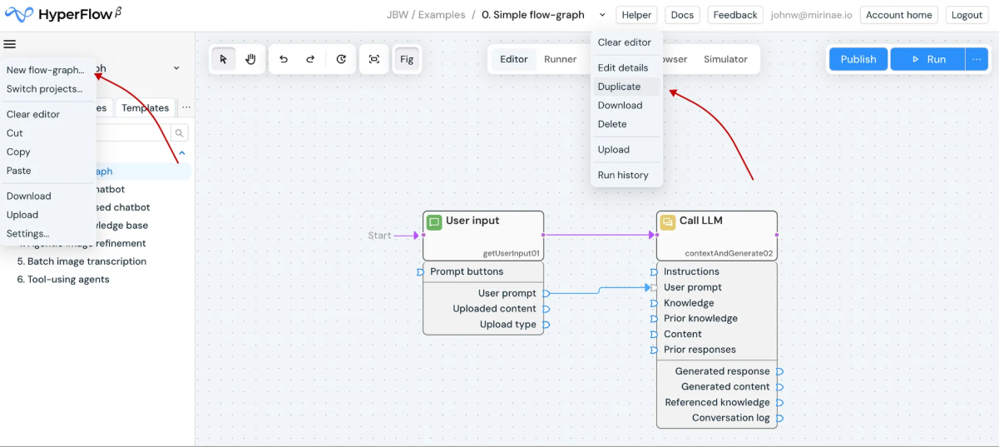
 

### **플로우그래프 생성하기: 노드를 생성하고 노드끼리 연결하기**

플로우 그래프는 **노드(Node)** 를 프로세스 흐름선과 데이터 흐름선으로 연결하여 구성됩니다. 노드는 좌측 디렉터리 창의 **"Node"** 탭에서 선택할 수 있으며, 기능별 그룹으로 정리되어 있습니다. 현재 HyperFlow에서는 약 40가지의 노드 유형을 제공하며, 각 노드는 AI 애플리케이션 및 워크플로우 개발과 관련된 특정 작업을 수행하도록 설계되어 있습니다.

노드를 플로우 그래프에 추가하려면 **"Node"** 탭에서 원하는 노드를 선택하여 플로우 그래프 작업 공간으로 드래그하면 됩니다. 예를 들어, 간단한 챗봇을 만들려면 먼저 사용자 입력을 받는 **User Input** 노드를 추가하고, 이후 사용자의 입력 프롬프트를 LLM에 전달하고 응답을 받는 **Call LLM** 노드를 연결할 수 있습니다.\
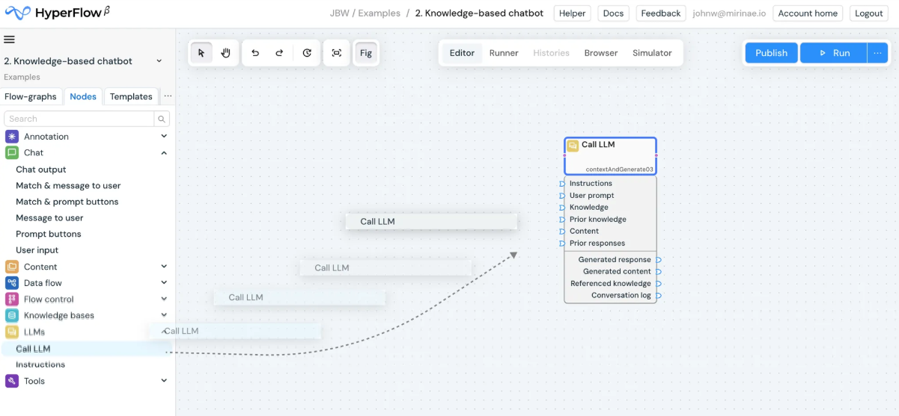
 

노드는 두 가지 유형의 선(커넥터)으로 연결되어 플로우 그래프를 구성합니다.

**프로세스 흐름 선(보라색):** 이 선은 노드들이 실행될 순서를 정의합니다. 예를 들어, **User input** 노드를 **Call LLM** 노드와 연결하면, 사용자 입력이 먼저 수집된 후 LLM 호출이 이루어져야 함을 의미합니다.

**데이터 흐름 선 (l파란색):** 이 선은 노드 간 데이터 전달 경로를 설정합니다. 예를 들어, **User input** 노드의 `User prompt` 출력값을 **Call LLM** 노드의 `User prompt` 입력값과 연결하면, 사용자의 입력이 LLM으로 전달됩니다.

연결을 하려면 프로세스 커넥터 포트 또는 데이터 흐름 커넥터 포트 위에 마우스를 올리면 작은 "+" 아이콘이 나타납니다. 이 상태에서 선을 클릭한 채로 원하는 연결 포트로 드래그하면 노드 간 연결이 생성됩니다.

노드는 다양한 입력 및 출력 포트를 가지며, 이는 각 노드의 기능에 따라 다릅니다. 이러한 세부 사항은 이후 가이드에서 더 자세히 다루며, 베타 문서의 노드 참조 섹션에서도 확인할 수 있습니다.

루프형 챗봇을 만들려면, **Call LLM** 노드의 프로세스 흐름 출력을 **User input** 노드의 입력에 다시 연결하면 됩니다.

HyperFlow는 *directed cyclic graphs*를 지원하여, 복잡한 AI 애플리케이션 및 워크플로우 구축이 가능합니다.
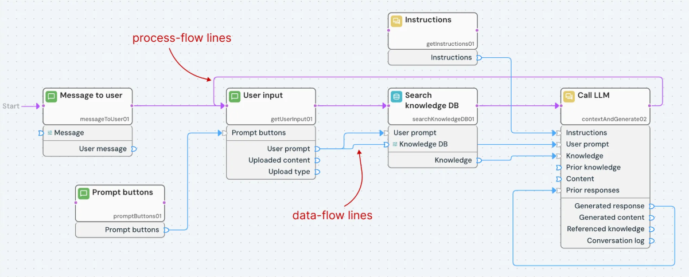
 

### 순수 데이터 노드

모든 노드가 꼭 프로세스 흐름(보라색 커넥터)으로 연결될 필요는 없습니다. 위 플로우 그래프에서 **Instructions** 노드가 그러한 예시입니다. 이러한 노드를 **순수 데이터 노드(Pure Data Nodes)** 라고 하며, 일반적으로 프로세스 흐름 내의 다른 노드에 데이터를 제공하는 역할을 합니다.

순수 데이터 노드는 플로우 그래프 엔진에 의해 **"온디맨드(on-demand)"** 방식으로 실행됩니다. 즉, 프로세스 흐름 내에서 해당 데이터를 필요로 하는 노드가 실행될 때 자동으로 호출됩니다. 또한, 순수 데이터 노드는 다른 순수 데이터 노드에서 입력을 받을 수도 있으며, 이를 통해 주요 프로세스 흐름 내에서 **데이터 기반 서브그래프**를 형성할 수 있습니다.

이처럼 HyperFlow는 **프로세스 기반 흐름과 데이터 기반 흐름을 하나의 플로우 그래프 내에서 결합**할 수 있는 기능을 제공합니다. 이를 통해 복잡한 연결을 단순화하면서도 유연한 데이터 처리가 가능해집니다.
 

### 플로우그래프 편집 및 관리

- **재연결(Rewiring):** 연결을 해제하고 싶은 경우 선의 끝을 잡고 빈 공간에 놓아 삭제하거나, 올바른 커넥터로 드래그하여 수정할 수 있습니다.
- **위치 조정(Repositioning):** 노드는 클릭한 상태에서 드래그하여 이동할 수 있습니다. 여러 노드를 동시에 선택하려면 선택 영역을 드래그하여 묶은 후 그룹으로 이동할 수 있습니다.
- **삭제(Deleting):** 노드를 마우스 오른쪽 버튼으로 클릭하면 컨텍스트 메뉴가 나타나며, **"Delete"**를 선택하면 해당 노드가 삭제됩니다.
- **실행 취소/다시 실행(Undo/Redo):** 상단 도구 모음의 실행 취소/다시 실행 버튼을 사용하거나 **Command + Z** 또는 **Control + Z** 단축키를 입력하여 작업을 되돌리거나 다시 실행할 수 있습니다.
- **복사/붙여넣기(Copy/Paste):** 특정 노드를 복사하여 다른 플로우 그래프에서 재사용할 수 있습니다.
    - 하나 이상의 노드를 선택한 후 **Command + C** 또는 **Control + C**를 눌러 복사하고, **Command + V** 또는 **Control + V**를 눌러 붙여넣습니다.
    - 또는 노드를 마우스 오른쪽 버튼으로 클릭하여 컨텍스트 메뉴에서 **Copy**, **Cut**, **Paste** 기능을 선택할 수도 있습니다.
 

### **노드 파라미터**

HyperFlow의 각 노드는 동작을 제어하는 파라미터**(하이퍼파라미터)** 를 가지고 있으며, 각 파라미터는 설정이 가능합니다. 편집기 화면에서 노드를 클릭하면, 오른쪽 패널에 해당 노드의 파라미터가 표시되며 이를 확인하고 수정할 수 있습니다.
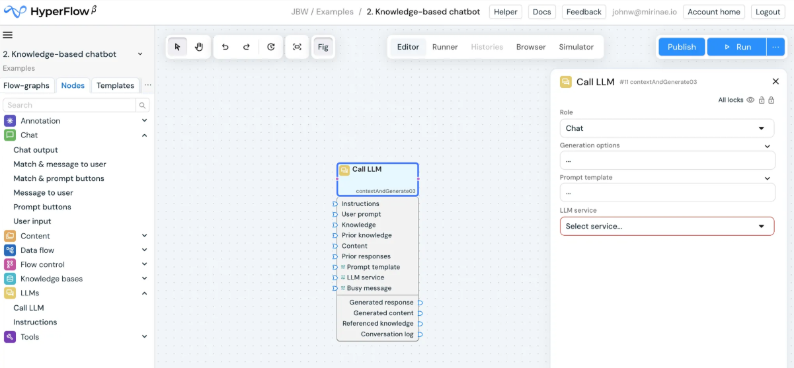
 

초기 설정을 단순화하기 위해 대부분의 노드는 기본값이 미리 지정되어 있습니다. 예를 들어, **User Input** 노드는 기본적으로 텍스트 입력을 받도록 설정되어 있지만, 파일 업로드를 허용하도록 구성할 수도 있습니다. **Call LLM** 노드는 기본적으로 채팅 기반 호출을 수행하지만, 이미지, 오디오, 비디오 등 다양한 미디어 유형을 생성하도록 설정할 수도 있습니다.

**Call LLM (LLM호출)** 노드는 LLM 서비스를 선택해야 하며, HyperFlow는 다양한 LLM 서비스를 제공하여 사용자가 선택할 수 있도록 합니다. 이 선택은 플로우 그래프 실행 전에 미리 설정할 수도 있고, 실행 시점까지 미룰 수도 있습니다. 만약 실행 시점까지 선택하지 않았다면, HyperFlow는 해당 노드에서 실행을 일시 중지하고 사용자의 선택을 요청합니다. 사용 가능한 서비스에는 주요 상용 LLM 서비스뿐만 아니라 다양한 오픈소스 모델을 지원하는 통합 Ollama 서버가 포함됩니다.

HyperFlow IDE 편집기에서 플로우 그래프를 구성하고 연결하는 과정에서는 각 노드를 클릭하여 **파라미터 패널을 열고 설정을 조정**하는 것이 일반적인 작업 방식입니다. 이러한 **"설정 시간(configuration time)"** 조정은 필수 사항은 아니며, 실행 시점(runtime)까지 매개변수 설정을 미룰 수도 있습니다. 하지만 각 노드의 옵션을 미리 검토하면, 실행 시 예상되는 동작을 보다 정확하게 이해하는 데 도움이 됩니다.

**파라미터 설정 연기하기**

HyperFlow의 독창적 기능 중 하나는 **매개변수 선택을 실행 시점까지 연기할 수 있는 옵션**입니다. 이를 통해 개발자는 일부 매개변수를 사전에 설정하면서도, 실행 중에 필요한 값들을 조정하여 애플리케이션을 테스트, 튜닝, 최적화할 수 있습니다.

### **개발자 모드에서 플로우그래프 실행하기**

플로우 그래프는 상단 우측 컨트롤 도구 모음의 **"Run"** 버튼을 클릭하여 **"개발자 모드(Developer Mode)"** 에서 실행할 수 있습니다. 이 모드에서는 플로우 그래프의 실행 과정을 보다 상세하게 확인할 수 있습니다.

개발자 모드에서 플로우 그래프를 실행하면:

1. 화면이 자동으로 확대 및 이동하여 현재 실행 중인 노드를 표시합니다.
2. 오른쪽에 두 개의 패널이 열립니다:
- **파라미터 패널(Parameter Panel):** 사용자 입력 및 실행 중 파라미터 조정이 가능합니다.
- **실행 세션 로그(Run Session Log):** 플로우 그래프의 실행 이력을 상세히 표시하며, 입력값, 출력값, 매개변수 설정 등 관련 정보를 확인할 수 있습니다.
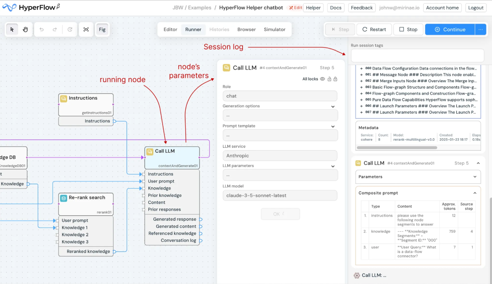
 

플로우 그래프가 실행되는 동안, **실행 세션 로그(Run Session Log)** 는 각 단계의 정보를 실시간으로 업데이트합니다. 필요에 따라 세부 정보를 확장하거나 축소하여 확인할 수 있습니다.

예를 들어, 위 이미지의 로그에서는 **지식 DB 검색 결과 및 검색 메타데이터**, **LLM에 전송된 복합 프롬프트**, **예상 토큰 수 및 소스 단계 번호** 등의 정보를 표시하고 있습니다. 또한, **Call LLM** 노드는 로딩 아이콘(회전하는 휠) 상태를 보여주며, 이는 LLM이 호출되었고, 생성된 응답을 기다리는 중임을 나타냅니다.

개발자는 실행 중인 플로우 그래프와 직접 상호작용할 수 있으며, 입력값을 제공하고 실행 세션 로그에서 결과를 확인할 수 있습니다. 실행 도중 언제든지 **"Pause"** 버튼을 눌러 **단계별 일시 정지 모드**로 전환할 수 있으며, 실행을 완전히 종료하고 편집 모드로 돌아가려면 **"Editor"** 버튼을 선택하면 됩니다. 이렇게 하면 추가 편집과 매개변수 조정 후 다시 테스트 실행을 진행할 수 있습니다.

실행 로그는 저장되며, 이후 **"Run"** 버튼의 드롭다운 메뉴에서 **"Run history"** 를 선택하면 다시 확인할 수 있습니다.

이 가이드는 HyperFlow에서 플로우 그래프를 생성하고 실행하는 기본 개념을 다룹니다. 앞으로의 가이드에서는 **단계별 실행(Single-Stepping), 중단점(Breakpoints), 매개변수 잠금 및 해제(Locking and Unlocking Parameters), 연결 가능한 매개변수(Wire-able Parameters), 데이터 흐름 내 기록 접근(History Access in Data Flows)** 등의 고급 기능을 더욱 자세히 살펴볼 예정입니다.

## 플로우 그래프 구축 및 실행: Part 2 - 에이전틱 AI 애플리케이션

이 가이드의 이번 섹션에서는 HyperFlow에서 플로우 그래프를 더욱 심층적으로 구축하고 실행하는 방법을 다룹니다. 이를 위해 **에이전틱 AI 애플리케이션**을 구성하는 과정을 예제로 설명합니다.

### 에이전틱 AI 애플리케이션

에이전틱 애플리케이션은 일반적으로 여러 개의 대형 언어 모델(LLM)이 포함되며, 각 모델이 더 큰 워크플로우에서 특정 역할을 수행합니다. 이러한 LLM은 각각 에이전트로 작동하며, 지정된 작업을 수행합니다.

이 예제에서는 두 개의 에이전트를 활용한 콘텐츠 생성 플로우를 구축합니다. 하나의 LLM은 사용자의 요청을 기반으로 이미지를 생성하고, 다른 LLM은 리뷰어 역할을 하며 사용자가 입력한 프롬프트를 개선하도록 도와줍니다. 개선된 프롬프트는 다시 첫 번째 LLM에 전달되며, 새로운 이미지가 생성됩니다. 이 과정은 사용자가 만족할 때까지 반복됩니다.

### 플로우 그래프 구축하기

첫 번째 단계는 새로운 플로우 그래프를 생성하고 편집기에서 여는 것입니다. 먼저 두 개의 Call LLM 노드를 추가합니다. 하나는 이미지 생성 역할을 하고, 다른 하나는 이미지 검토 역할을 수행합니다. 이러한 노드는 노드 탭에서 드래그하여 추가하거나, 편집기의 오른쪽 클릭 컨텍스트 메뉴를 사용하여 추가할 수 있습니다. 또한, 초기 이미지 요청을 받을 **User input** 노드와, 검토 에이전트에게 지침을 제공할 **Instructions** 노드도 필요합니다.
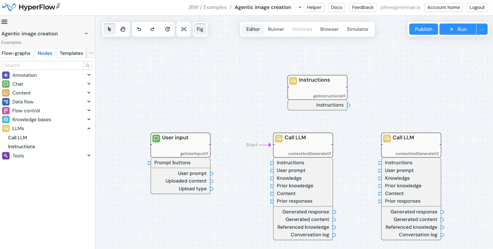
 

처음 추가한 노드는 Call LLM 노드이며, 플로우 그래프에서는 첫 번째로 추가된 노드가 자동으로 시작 노드로 지정됩니다. 하지만 우리는 **User input** 노드를 시작점으로 설정해야 합니다. 이를 위해 **User input** 노드를 마우스 오른쪽 버튼으로 클릭한 후 **"Set as Start Node"** 를 선택합니다.
 

### 프로세스 흐름 연결

다음으로, 보라색 프로세스 흐름 선을 사용하여 노드들을 연결하여 프로세스 흐름을 구성합니다. 실행 순서는 **User Input → 이미지 생성 LLM → 리뷰어 LLM** 순서로 설정합니다. 반복적인 프롬프트 개선 과정을 관리하기 위해 **Loop Controller** 노드를 추가합니다. 리뷰어 LLM의 프로세스 흐름 출력을 **Loop Controller** 노드에 연결합니다. 그런 다음 **Loop Controller**의 "max loop count" 매개변수를 3과 같이 특정 값으로 설정하여 반복 실행 횟수를 제한합니다. **Loop Controller**의 상단 출력 커넥터는 **"loop continue"** 출구이며, 이를 **Image Generator LLM**의 입력 커넥터와 연결하여 반복 실행 구조를 완성합니다.
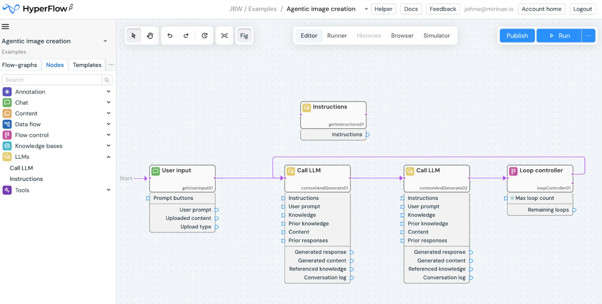
 

HyperFlow에서는 매개변수를 **잠금(Locking)** 및 **해제(Unlocking)** 할 수 있습니다. 잠금이 해제된 매개변수는 해당 노드에서 플로우 그래프 실행을 일시 중지시키며, 실행 중에 값을 조정할 수 있도록 합니다. 반면, 잠긴 매개변수는 사전에 설정된 값을 사용하며 실행을 멈추지 않습니다.

이번 설정에서는 **"max loop count"** 매개변수를 잠가, 루프 컨트롤러에서 실행이 멈추지 않고 플로우 그래프가 원활히 진행되도록 합니다. 매개변수는 개별적으로 잠글 수도 있으며, 매개변수 위에 마우스를 올리면 나타나는 **잠금 아이콘**을 클릭하여 설정할 수 있습니다. 또한, **"Lock all"** 버튼을 사용하면 매개변수 패널의 모든 매개변수를 한 번에 잠글 수도 있습니다.
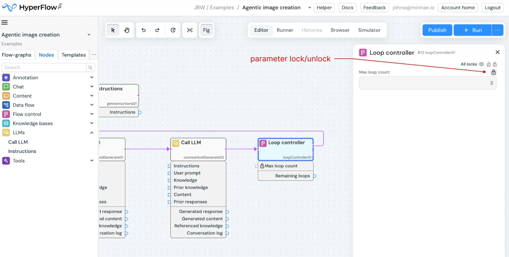
 

기본적으로 **Call LLM** 노드는 채팅 또는 텍스트 생성 기능이 활성화되어 있습니다. **Image Generator LLM**의 매개변수를 잠금 해제하고, 역할(Role)을 **"Image generator"** 로 설정해야 합니다. 이 설정을 변경하면 **이미지 생성을 지원하는 LLM 서비스 목록으로 자동 업데이트**되며, 해당 서비스 중에서 적절한 모델을 선택할 수 있습니다.
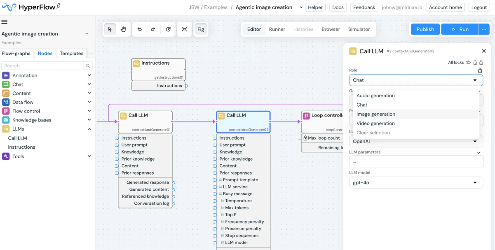
 

### 데이터 흐름 연결

이제 데이터 흐름을 구성합니다. **User input** 노드의 `User prompt`출력은 **Image Generator LLM**의 **User prompt** 입력과 연결됩니다. **Image Generator LLM**의 **generated content** 출력은 **Reviewer LLM**의`Content` 입력과 연결됩니다. **Instructions** 노드의 **Instructions** 출력은 **Reviewer LLM**의 `Instructions` 입력과 연결됩니다. 마지막으로, **Reviewer LLM**의 **Generated response** 출력(개선된 프롬프트)을 **Image Generator LLM**의 입력과 연결해야 합니다.

그러나 현재 HyperFlow 버전에서는 하나의 데이터 흐름 입력 커넥터가 하나의 입력 소스만 받을 수 있습니다. 이를 해결하기 위해 **Merge inputs** 노드를 추가합니다. 이 노드는 원래 사용자 프롬프트와 **Reviewer LLM**에서 생성된 개선된 프롬프트를 병합하여 가장 최근에 받은 데이터를 전달합니다. **User input** 노드의 `User prompt` 출력은 **Merge inputs** 노드의 `Input 1`에 연결하고, **Reviewer LLM**의 `Generated response` 출력은 `Input 2`에 연결합니다. 마지막으로, **Merge inputs** 노드의 출력은 **Image Generator LLM**의 `User prompt` 입력과 연결합니다.

아래에서 최종 구성된 플로우 그래프를 확인할 수 있습니다. HyperFlow의 자동 배선 레이아웃은 일반적으로 직관적인 연결을 제공하지만, 경우에 따라 배선이 다른 노드 뒤에 숨겨지거나 실제 연결된 포트와 다르게 보일 수도 있습니다. 출력 포트가 어디에 연결되어 있는지 확인하려면, 해당 출력 포트의 이름을 클릭하면 됩니다. 그러면 아래 이미지에서처럼 모든 연결 지점과 배선이 빨간색으로 강조 표시됩니다.
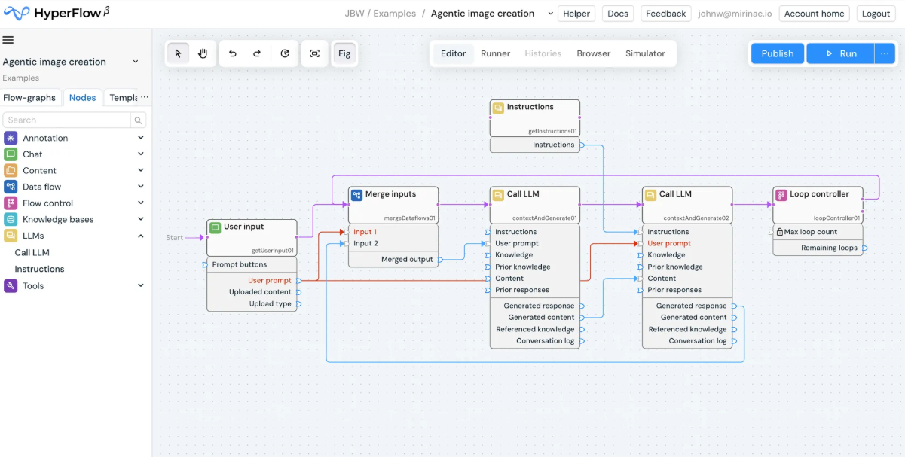
 

### LLM 지시 - 프롬프트 엔지니어링

**Instructions** 노드는 **Reviewer LLM**의 동작을 조정하는 데 중요한 역할을 합니다. 여기에서 **프롬프트 엔지니어링**이 적용되며, 이는 효과적인 생성형 AI 애플리케이션을 구축하는 데 있어 가장 중요하면서도 까다로운 요소 중 하나로 여겨집니다. 이 노드에서 제공하는 지침은 **Reviewer LLM**의 출력 품질과 적절성에 직접적인 영향을 미치며, 이는 궁극적으로 에이전틱 시스템 전체의 성능에도 영향을 줍니다.

이 예제에서 **Reviewer LLM**은 생성된 이미지를 분석하고, 이를 생성한 프롬프트를 개선하는 방안을 제안하는 역할을 합니다. 우리가 제공하는 지침에 따라 이 작업을 수행하는 방식이 결정됩니다. 예를 들어, 다음과 같은 지시를 내릴 수 있습니다:

"*사용자의 프롬프트를 이미지 요청으로 검토하고, 제공된 이미지를 원래 사용자의 요청 프롬프트와 비교하여 분석한 후, DALL-E 3을 위한 상세한 프롬프트 형태로 개선안을 제안하세요. 반드시 제공된 이미지의 구조와 내용을 그대로 반복할 필요는 없으며, 원래 프롬프트에 더 적합할 수 있는 다양한 변형을 시도하세요. 출력은 오직 상세한 DALL-E 3 프롬프트만 포함해야 하며, 추가적인 설명이나 비평은 포함하지 마세요*."

이 지침이 이렇게 구성된 이유와 정확한 표현이 중요한 이유를 분석해 보겠습니다:

- **"사용자의 프롬프트를 이미지 요청으로 검토하고, 제공된 이미지를 원래 사용자의 요청 프롬프트와 비교하여 분석하세요..."** 이 문장은 LLM의 역할을 **이미지 비평가**로 설정하는 중요한 지침입니다. 또한, 단순히 이미지 자체를 평가하는 것이 아니라, **생성된 이미지와 사용자의 초기 요청을 함께 고려해야 함**을 강조하여 보다 정밀한 분석을 유도합니다.
- **"...DALL-E 3을 위한 상세한 프롬프트 형태로 개선안을 제안하세요."** 이 문장은 원하는 출력을 명확하게 규정합니다. 즉, 단순한 피드백이 아니라, **DALL-E 3에서 바로 활용할 수 있는 구체적인 개선 프롬프트**를 생성하도록 요구합니다. 또한 **"상세한(detailed)"** 이라는 표현을 사용하여 보다 **포괄적이고 묘사적인 프롬프트**를 생성하도록 유도합니다.
- **"반드시 제공된 이미지의 구조와 내용을 그대로 반복할 필요는 없으며, 원래 프롬프트에 더 적합할 수 있는 다양한 변형을 시도하세요."** 이 지침은 매우 중요한 역할을 합니다. 단순히 기존 프롬프트를 재구성하는 것이 아니라, **창의적으로 접근하여 사용자 의도를 더 잘 반영할 수 있는 다양한 표현 방식을 탐색**하도록 LLM을 유도합니다. 이를 통해 보다 **다양하고 흥미로운 이미지 생성이 가능**해집니다.
- **"출력은 오직 상세한 DALL-E 3 프롬프트만 포함해야 하며, 추가적인 설명이나 비평은 포함하지 마세요."** 이 제한은 **출력의 명확성과 실용성을 보장**하는 역할을 합니다. LLM이 불필요한 설명이나 의견을 추가하는 것을 방지하고, **이미지 생성 LLM에서 즉시 활용할 수 있도록** 출력을 깔끔하게 유지하도록 합니다. 이를 통해 시스템이 혼란을 겪지 않고 원활하게 작동할 수 있습니다.

**프롬프트 엔지니어링의 중요성과 도전 과제**

LLM 기반 애플리케이션의 효과는 **프롬프트의 품질**에 크게 좌우됩니다. 잘못 구성된 프롬프트는 **관련성이 낮거나, 부정확하거나, 비논리적인 출력**을 초래할 수 있습니다. 따라서 효과적인 프롬프트를 설계하는 것, 즉 **"프롬프트 엔지니어링"** 은 생성형 AI 애플리케이션 개발에서 필수적인 기술입니다.

프롬프트 엔지니어링은 **반복적인 실험과 세밀한 조정을 필요로 하는 과정**입니다. LLM이 언어를 해석하는 방식의 미묘한 차이를 이해하고, **표현 방식이나 지시문의 변화에 따라 출력이 크게 달라질 수 있음을 고려해야 합니다**. 심지어 **아주 작은 문구 변경만으로도 LLM의 출력에 큰 영향을 미칠 수 있습니다**.

**프롬프트 엔지니어링의 핵심 고려 사항:**

- **명확성과 구체성(Clarity and Specificity):** 프롬프트는 명확하고 모호하지 않으며, 원하는 출력에 대해 구체적으로 설명해야 합니다. 애매하거나 열린 결말의 지시문은 LLM이 잘못 해석할 가능성이 있습니다.
- **맥락과 제한 조건(Context and Constraints):** LLM이 작업을 올바르게 이해할 수 있도록 충분한 맥락을 제공하고, 준수해야 할 제한 조건을 명확히 제시해야 합니다. 이번 예제에서는 **대상 모델(DALL-E 3)** 과 **출력 형식**을 명확히 지정했습니다.
- **창의성과 탐색(Creativity and Exploration):** LLM이 다양한 가능성을 탐색하고, **다양한 출력을 생성하도록 유도**해야 합니다. 이를 위해 프롬프트에서 변형을 시도하도록 지시했습니다.
- **반복적인 개선(Iterative Refinement):** 여러 프롬프트를 실험하고 결과를 분석하며 지속적으로 개선할 준비가 필요합니다. 초기 프롬프트가 최적의 형태일 가능성은 낮으므로, **반복적인 조정을 통해 최상의 성능을 이끌어내야 합니다**.

에이전틱 플로우에서 **Reviewer LLM**에 제공되는 지침은 **개선된 프롬프트의 품질**에 직접적인 영향을 미치며, 이는 반복적으로 생성되는 이미지의 품질에도 영향을 줍니다. 최상의 결과를 얻기 위해서는 이러한 지침을 **실험을 통해 정교하게 다듬을 필요**가 있습니다. 예를 들어, 지침의 구성 방식을 변경해 보거나, **우수한 이미지 생성 예시와 요청 프롬프트 간의 관계를 명확히 설명하는 방법**, 혹은 리뷰어 LLM이 특정 **전문가 역할(Persona)을 설정하도록 유도하는 방법**을 시도해볼 수 있습니다.

프롬프트 엔지니어링은 **반복적인 실험, 관찰, 조정**을 필요로 하며, LLM 기반 AI 애플리케이션을 구축하는 과정에서 **가장 많은 신중함과 실험이 요구되는 부분** 중 하나입니다. 효과적이고 신뢰할 수 있는 생성형 AI 애플리케이션을 개발하려면 이 기술을 숙달하는 것이 필수적입니다.

현재는 이 지침을 **잠가(Lock)** 두지만, 애플리케이션이 개발 및 테스트를 거듭하면서 **추후 재검토 및 개선이 필요할 가능성이 높다는 점을 염두에 두어야 합니다**.
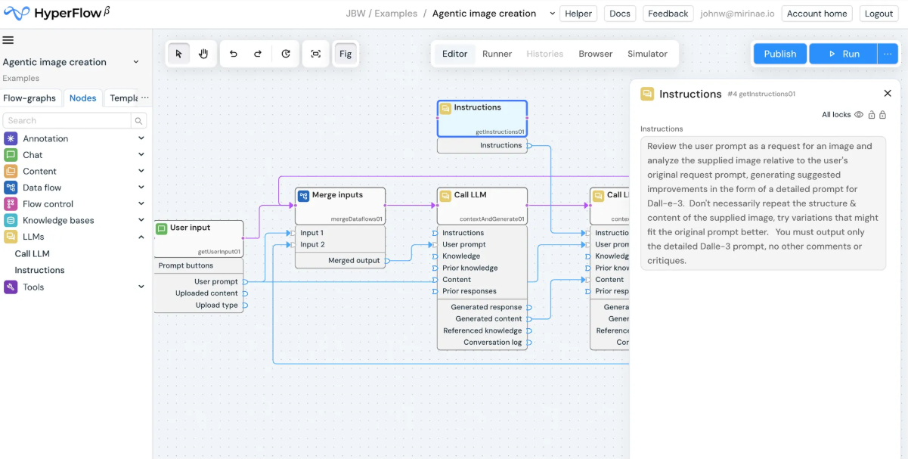
 

### 순수 데이터 노드

**Instructions** 노드와 같은 일부 노드는 **순수 데이터(pure data)** 노드입니다. 이러한 노드는 데이터를 제공하지만 프로세스 흐름에 직접 연결될 필요가 없습니다. 대신, 입력 데이터를 받는 노드가 필요할 때 **자동으로 실행(on demand)** 됩니다. HyperFlow는 **데이터 흐름과 유향 프로세스 흐름을 하나의 그래프에서 혼합하여 사용할 수 있는 기능**을 지원하며, 이는 HyperFlow만의 독창적인 기능입니다.

플로우 그래프를 실행하기 전에 각 노드의 매개변수를 검토합니다. **Merge inputs** 노드는 실행 중 변경할 필요가 없으므로 매개변수를 **잠가(Lock)** 둘 수 있습니다. **Image Generator LLM**의 경우, 적절한 LLM 서비스(예: OpenAI)와 이미지 생성 모델(예: DALL-E 3)을 선택합니다. 또한 생성된 이미지를 체계적으로 정리하기 위해 태그를 추가할 수도 있습니다. **Reviewer LLM**의 경우, 이미지 분석이 가능한 멀티모달 모델(예: OpenAI GPT-4.0)을 선택하고, 모델 선택을 잠가 두어 실행 중 변경되지 않도록 설정합니다.

각 반복 루프에서 **수정된 이미지 프롬프트를 확인할 수 있도록 중단점을 추가**합니다. 이를 위해 **Image Generator LLM**을 마우스 오른쪽 버튼으로 클릭한 후 **"Toggle breakpoint"** 를 선택하면 됩니다.
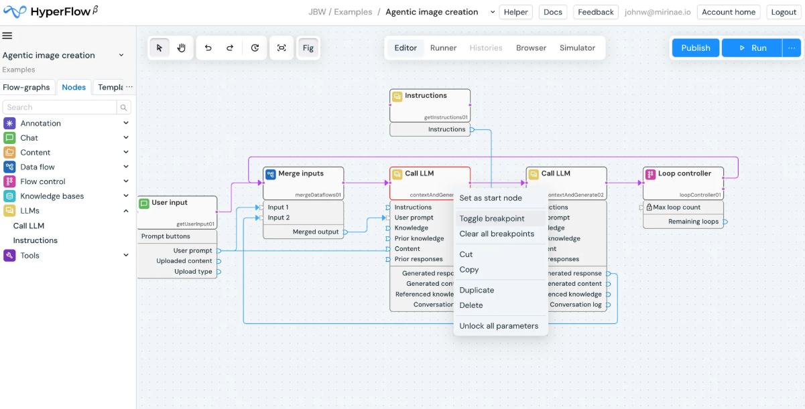
 

### 테스트 챗봇 모드에서 플로우 그래프 실행하기

플로우 그래프를 테스트 챗봇 인터페이스에서 실행하려면 **Run** 버튼 오른쪽 드롭다운 메뉴에서 **"Run in Chatbot"** 을 선택합니다. 그러면 **HyperFlow IDE의 테스트 챗봇 창이 IDE 좌측에 열립니다**. 테스트 챗봇 모드에서도 **개발자 모드 기능이 활성화된 상태로 유지**되며, 이를 통해 **매개변수 패널과 실행 세션 로그를 확인하면서 플로우 그래프의 실행 과정을 상세히 분석할 수 있습니다**.

테스트 챗봇의 **매개변수 패널**은 **사용자의 초기 입력을 요청**합니다. 예를 들어, 다음과 같은 이미지 요청을 입력할 수 있습니다. *"빨간 코트를 입고 얼음 위에서 신나게 스케이트를 타는 행복한 펭귄."*

**Image Generator LLM**에 설정된 **중단점(Breakpoint)** 때문에, 플로우 그래프는 해당 노드에서 실행을 일시 정지합니다.이때 **단계 컨트롤러 버튼(Step Controller Buttons)** 이 나타나며, 실행 세션 로그에는 **"Waiting on next step"** 이 표시됩니다. "Step"을 누르면 현재 노드가 실행되고 다음 노드에서 다시 일시 정지됩니다. "Continue"를 누르면 **다음 사용자 입력, 중단점, 혹은 플로우 그래프 종료 시점까지 실행이 계속됩니다**.**실행 세션 로그**에서는 **각 단계의 상세 실행 정보를 확인**할 수 있으며, **Merge inputs** 노드의 출력을 직접 확인하여 **가장 최근에 전달된 데이터가 어떻게 처리되는지 분석할 수 있습니다**.
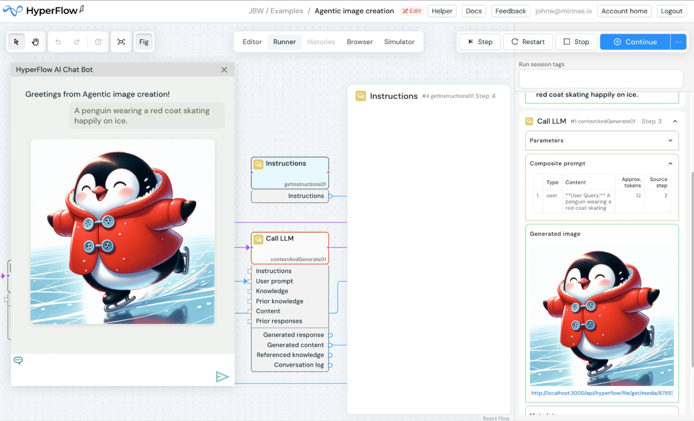
 

Image Generator LLM을 단계별로 실행하면서 선택한 이미지 생성 모델에 요청을 보냅니다. 생성된 이미지는 테스트 챗봇 창에 표시됩니다.

플로우 그래프는 **Instructions** 노드에서 일시 정지된 것처럼 보일 수 있습니다. 이는 **순수 데이터 노드(pure data node)** 이며, 입력을 필요로 하는 **Reviewer LLM**이 실행할 때 자동으로 실행되기 때문입니다. **"Continue"** 버튼을 누르면 실행이 재개됩니다. Reviewer LLM은 생성된 이미지, 제공된 지침, 그리고 사용자의 원래 요청을 분석합니다. 실행 세션 로그에서 **Reviewer LLM에 전달된 복합 프롬프트**를 확인할 수 있으며, 생성된 리뷰와 개선된 프롬프트도 로그에 표시됩니다.

플로우 그래프는 **Image Generator LLM**으로 다시 되돌아가며, 중단점 때문에 다시 일시 정지됩니다. 이때 **Merge inputs** 노드의 출력은 개선된 프롬프트가 됩니다. Image Generator LLM을 단계별로 실행하면 새로운 프롬프트를 기반으로 새로운 이미지가 생성됩니다. 플로우 그래프를 계속 실행하면서 테스트 챗봇과 실행 세션 로그에서 결과를 확인할 수 있습니다.

반복 횟수 제한으로 인해 플로우 그래프는 결국 **"end of run"** 상태에 도달합니다. 실행된 모든 단계는 **세션 로그에 기록되며 분석할 수 있으며**, 생성된 이미지는 **세션 로그에서 다운로드**할 수 있습니다.

### 플로우그래프 개선하기

플로우 그래프는 더욱 개선될 수 있습니다. 고정된 반복 횟수를 사용하는 대신, **Choose path** 노드를 추가하여 사용자가 반복을 계속할지 여부를 결정하도록 할 수 있습니다. **Choose path** 노드는 사용자에게 **"Keep Going"** 또는 **"Stop"** 과 같은 선택지를 제공합니다. **"Keep Going"** 경로는 **Image Generator LLM**으로 다시 연결되어 프롬프트 개선과 이미지 생성을 반복합니다. **"Stop"** 경로는 연결되지 않은 상태로 유지되어 플로우 그래프 실행을 종료합니다.
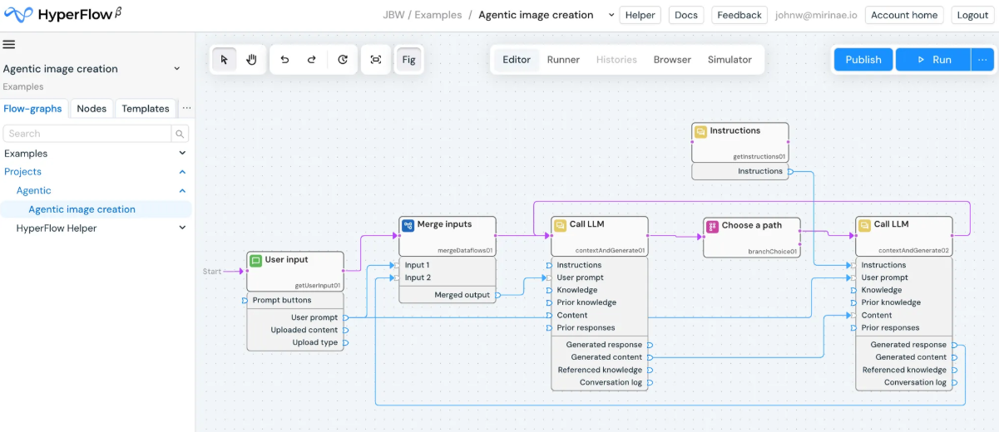
 

### 플로우 그래프를 더욱 개선하기: 사용자 상호작용 추가

초기 플로우 그래프는 자동 반복 루프를 통해 이미지 개선을 수행하도록 설계되었습니다. 그러나 이를 더욱 향상시키는 방법 중 하나는 사용자가 직접 개선 과정에 참여할 수 있는 기능을 추가하는 것입니다. 사용자가 직접 의견을 제공하고 LLM이 보다 원하는 결과로 조정될 수 있도록 유도하는 방식입니다. 이 섹션에서는 플로우 그래프를 수정하여 사용자 상호작용을 포함하는 예제를 설명하며, 이를 통해 보다 협력적이고 동적인 시스템으로 전환하는 방법을 소개합니다.

이 개선된 버전에서는 워크플로우 내에 새로운 분기를 추가하여 사용자가 이미지 생성 과정에 직접 개입할 수 있도록 합니다. 이를 위해 **Choose path** 노드를 수정하고, 사용자 입력을 처리하는 새로운 경로를 추가합니다.
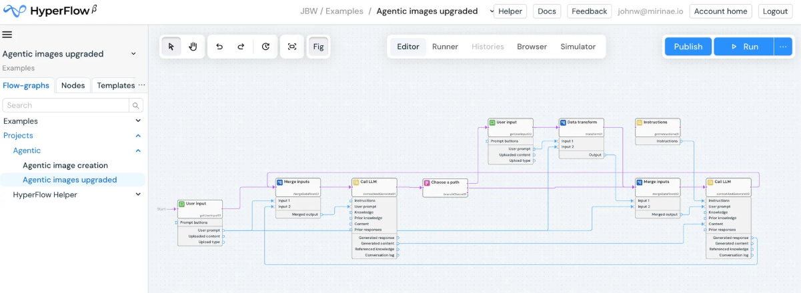
 

다음은 수정된 부분에 대한 자세한 설명입니다.
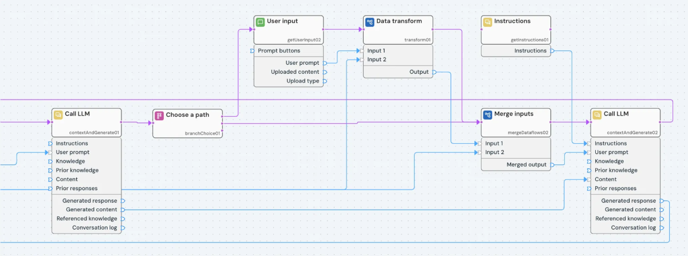
 

**Choose path 노드 수정**

기존의 "Keep Going"과 "Stop" 두 가지 선택지만 제공하던 **Choose path** 노드를 수정하여 세 가지 옵션을 사용자에게 제시하도록 변경합니다.

1. **Enter a Suggestion:** 사용자가 직접 **Reviewer LLM**에 구체적인 지침을 제공하여, 개선 과정이 새로운 방향으로 진행될 수 있도록 합니다.
2. **Keep Going:** 기존 자동 루프를 유지하며, **Reviewer LLM**이 사용자 입력 없이 프롬프트를 계속 개선합니다.
3. **Stop:** 플로우 그래프 실행을 종료합니다.

이러한 수정은 사용자가 원하는 상호작용 수준을 선택할 수 있도록 하여, 직접 개입하거나 자동 개선 과정을 그대로 유지할 수 있도록 합니다.

**"사용자 개선" 경로**

사용자가 **"Enter a Suggestion"** 옵션을 선택하면, 플로우 그래프는 사용자의 입력을 캡처하고 통합하는 새로운 경로를 따르게 됩니다.

1. **User Input Node:** 이 경로에는 추가적인 **User input** 노드가 도입됩니다. 이 노드는 사용자에게 이미지 개선을 위한 제안을 입력하도록 요청합니다. 사용자는 이미지의 세부적인 조정부터 구도나 스타일의 근본적인 변경까지 다양한 내용을 입력할 수 있습니다.
2. **Data Transform Node:** 사용자의 제안과 원래 요청은 **Data transform** 노드로 전달됩니다. 이 노드는 두 개의 입력을 하나의 일관된 데이터로 변환하도록 설정됩니다. 변환 과정은 템플릿을 사용하여 원래 요청과 새로운 제안이 모두 반영되도록 구성됩니다. 예를 들어, 템플릿을 `"Original request: [Original Request]. User suggestion: [User Suggestion]."` 과 같은 형식으로 설정할 수 있습니다.
    
    **Data transform** 노드는 HyperFlow에서 매우 유연하게 활용될 수 있는 구성 요소입니다. 이 예제에서는 간단한 템플릿을 사용하지만, 문자열 형식 지정, 데이터 집계, 심지어 **사용자 지정 Python 코드 실행**과 같은 복잡한 데이터 변환도 수행할 수 있습니다. 이를 통해 플로우 그래프 내에서 보다 정교한 데이터 처리 및 변환이 가능합니다. **Data transform** 노드의 기능을 자세히 다루는 전용 영상도 제공될 예정입니다.
    
3. **Modified Merge Inputs Node:** "Keep Going" 경로를 선택하면 사용자 입력 없이 기존 **Merge inputs** 노드로 직접 연결됩니다. 이 노드는 **Data transform** 노드에서 변환된 입력(사용자 제안 포함) 또는 원래 사용자 입력 중 최근 데이터를 전달하도록 설정됩니다. 즉, **Choose path** 노드에서 사용자의 선택에 따라 **Reviewer LLM**이 원래 요청을 받을 수도 있고, 사용자 제안이 추가된 수정된 요청을 받을 수도 있습니다.

이 설정의 가장 큰 장점은 **사용자가 이미지 생성 과정에서 추가적인 지침을 제공할 수 있도록 유연성을 제공하면서도, 두 개의 LLM이 협력하여 자동으로 프롬프트를 개선하는 기능을 그대로 유지할 수 있다는 점입니다.**

**Reviewer LLM에 미치는 영향**

이러한 방식으로 플로우 그래프를 수정함으로써, **Reviewer LLM**은 이제 원래 사용자의 요청뿐만 아니라 이후 추가된 사용자 제안도 함께 고려할 수 있게 됩니다. 이를 통해 생성되는 프롬프트가 사용자 의도에 더욱 부합하며, 이미지 개선 과정에서 사용자의 피드백이 중요한 요소로 작용하게 됩니다. 결과적으로, 플로우 그래프는 보다 **상호작용적이고 협업적인 환경**을 제공할 수 있습니다.

이렇게 개선된 플로우 그래프는 **HyperFlow**가 어떻게 동적인 사용자 중심 AI 애플리케이션을 구축하는 데 활용될 수 있는지를 보여줍니다. 워크플로우에 사용자 피드백을 통합함으로써, 애플리케이션은 개별 사용자의 요구에 더욱 효과적으로 반응하고 적응할 수 있습니다. 이 예제는 **자동화된 프로세스와 인간의 개입을 결합함으로써 보다 창의적이고 만족스러운 결과를 얻을 수 있음을 강조합니다**. 앞으로 제공될 영상에서는 다른 고급 노드와 기능을 탐색하며, 더욱 정교한 AI 워크플로우 구축 가능성을 제시할 예정입니다.

이러한 수정 과정은 **AI 애플리케이션 개발에서 흔히 사용되는 반복적인 개선 과정**을 보여줍니다. 구축(Build), 실행(Run), 분석(Analyze), 개선(Refine)의 단계를 거치며, HyperFlow는 이 과정을 효과적으로 지원하는 다양한 도구와 기능을 제공합니다. 이번 예제에서는 비교적 단순한 에이전틱 시스템을 다루었지만, HyperFlow는 이를 기반으로 **보다 복잡하고 다양한 AI 워크플로우를 구축하는 데 활용될 수 있으며, 여기서 다룬 원칙들은 더욱 정교한 시나리오에도 적용할 수 있습니다**.

### HyperFlow AI 도우미 챗봇

현재 HyperFlow IDE에는 **실험적인 RAG 기반 보조 챗봇**이 도입되어 있습니다. 이 챗봇은 최신 HyperFlow 문서와 기타 배경 자료를 학습하여 작동합니다. 완벽하지는 않지만, 문서에서 적절한 내용을 찾아낼 수 있는 경우가 많아 HyperFlow를 익히는 데 도움을 줄 수 있습니다. 이 챗봇은 물론 **HyperFlow를 활용해 개발되었으며**, 실제로 RAG 플로우 그래프를 다룬 튜토리얼 영상 5에서 나온 예제에서 시작되었습니다. 예상보다 적은 학습 데이터로도 뛰어난 성능을 보였기 때문에, 이를 HyperFlow 내에서 임베드할 수 있는 챗봇 형태로 감싸 IDE에 직접 탑재하게 되었습니다!
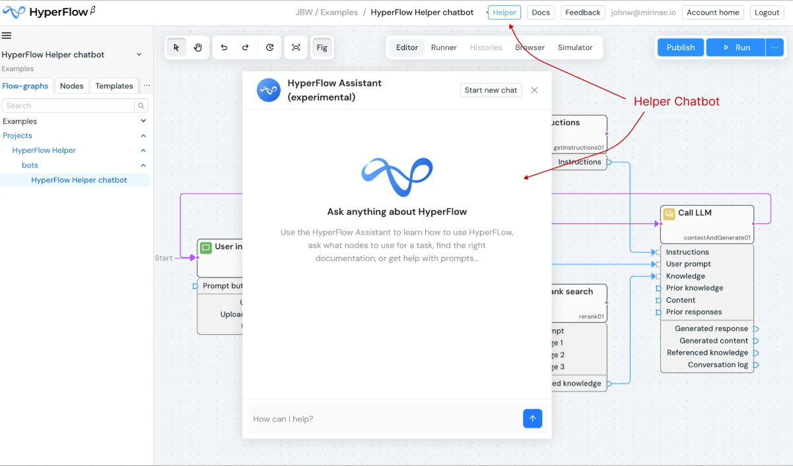
 

[[TOP]](#index)

---

