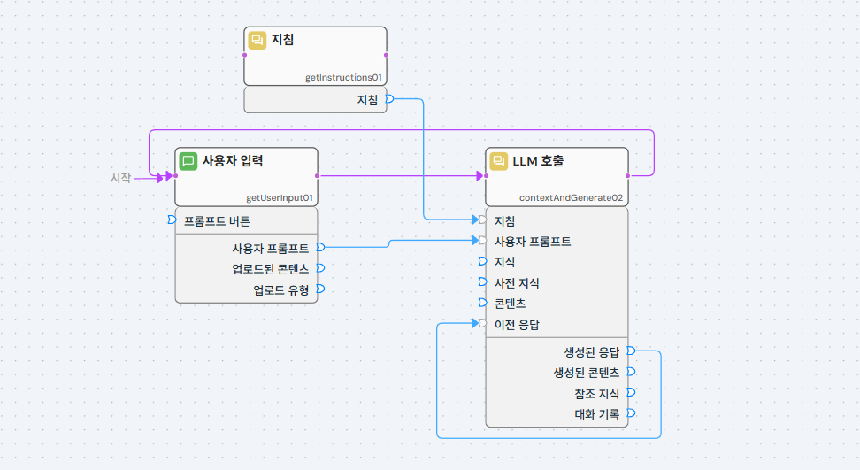
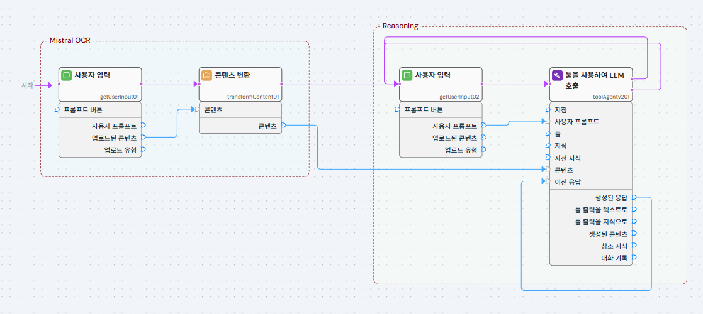

---

# FlowGraph Templete
AI 프로젝트를 시작하기 위한 사전 구축된 템플릿을 탐색하세요

 

[[TOP]](#hyperflow-ai)

---
### 스타터 템플릿
HyperFlow의 가장 인기 있는 사용 사례로 빠르게 시작할 수 있도록 설계된 빠른 시작 템플릿입니다.​

- 개요​
이러한 템플릿은 최소한의 설정으로 사용할 준비가 된 사전 구성된 워크플로우를 제공합니다. 다음에 완벽합니다:​
  - HyperFlow 기능을 탐색하는 처음 사용자​
  - AI 애플리케이션의 신속한 프로토타이핑​
  - 작동하는 예제를 통한 모범 사례 학습​
  - Learning best practices through working examples

- 시작하기​
  - 사용 사례에 맞는 템플릿을 선택하세요​
  - 프로젝트에 복제하세요​
  - 필요에 맞게 구성을 사용자 정의하세요​
  - 워크플로우를 실행하고 반복하세요

 

[[TOP]](#hyperflow-ai)

---
### 기본 챗봇
HyperFlow로 만들 수 있는 가장 간단한 대화형 챗봇입니다. LLM을 통해 최종 사용자와 상호작용하는 더욱 정교한 대화형 챗봇 및 어시스턴트를 개발하는 데 이상적인 출발점입니다.

- **작동 원리**
흐름 그래프는 세 개의 노드를 사용하며, 그 중 두 개는 프로세스 흐름 루프로 연결됩니다.

1. 사용자 입력 노드 → 시작 노드입니다. 사용자 쿼리나 콘텐츠 업로드를 캡처하고(현재 프로젝트의 에셋 스토어에 저장되므로 태그를 한두 개 추가하는 것을 잊지 마세요), 사용자 입력을 해당 노드 User prompt또는 Uploaded content출력 데이터 포트에서 사용할 수 있도록 합니다.   
2. 지침 노드 → 이 노드에서는 챗봇의 성격과 행동을 정의하는 서면 지침을 제공합니다. 이는 일반적으로 "프롬프트 엔지니어링"의 핵심입니다. 프로세스 흐름에 연결되어 있지 않고, "순수 데이터" 노드이며 해당 노드의 출력을 사용하는 노드가 실행될 때 자동으로 실행됩니다.   
3. LLM 노드 호출 → 데이터 포트에 연결된 명령어 Instruction, 포트에 연결된 사용자 프롬프트, User prompt그리고 대화 내역에 대한 이전 LLM 응답으로 구성된 복합 프롬프트를 생성하여 선택한 LLM으로 전송합니다. 편집기 모드에서 노드를 클릭하여 구성 매개변수를 통해 LLM 서비스, 모델 및 모달리티를 선택할 수 있습니다. 이 노드는 별도로 구성하지 않는 한 사용자에게 LLM 응답을 자동으로 표시합니다.   

주요 특징은 다음과 같습니다.

- 프로세스 흐름 루프 : Call LLM의 종료가 User Input의 항목으로 다시 연결되어 대화 주기를 생성합니다.
- 순수 데이터 실행 : Call LLM에 데이터가 필요할 때 Instructions 노드가 자동으로 실행되어 배선이 간소화됩니다.

**데이터 흐름**
- 사용자 프롬프트는 사용자 입력에서 호출 LLM으로 흐릅니다.
- 시스템 지침은 지침 노드에서 호출 LLM으로 흐릅니다.
- Prior responses생성된 응답은 Call LLM 노드의 입력 으로 다시 돌아가 대화 기록을 작성합니다.
- 각 응답은 Call LLM 노드에 의해 자동으로 사용자에게 표시됩니다.

**빠른 사용자 정의**
- 성격 변경 : 지침 노드 텍스트 편집
- 파일 업로드 추가 : 사용자 입력 모드를 "선택적 업로드 + 텍스트 입력"으로 변경
- AI 모델 전환 : LLM 호출 노드에서 다른 모델을 선택하세요
- 프롬프트 제안 추가 : 프롬프트 버튼 노드를 추가하고 사용자 입력 노드 Prompt buttons의 입력 에 연결하여 제안된 프롬프트 버튼을 구성합니다.

**사용 사례**
- 고객 서비스 챗봇
- 교육 Q&A 조수
- 범용 AI 동반자
- 대화형 도움말 시스템
위의 사용 사례 중 일부를 보려면 Starter Chatbots 템플릿의 다른 예를 참조하세요.

**HyperFlow 작업**

 

[[TOP]](#hyperflow-ai)

---
### 미스트랄 문서 OCR 및 AI 추론 채팅 : Mistral Document OCR & AI Reasoning Chat
이 흐름을 사용하면 PDF나 이미지 파일을 업로드하고, Mistral AI OCR을 사용하여 텍스트 내용을 추출한 다음, 추론 기반 LLM을 사용하여 문서 내용에 대한 질문을 할 수 있습니다.

**사용 참고 사항:**
이 템플릿은 문서와 "채팅"할 수 있는 기능을 제공합니다. 먼저 업로드된 파일에 광학 문자 인식(OCR)을 수행한 다음, AI 모델을 사용하여 추출된 텍스트를 기반으로 질문에 답변합니다.

#### 1부: 문서 업로드 및 OCR

- User input(getUserInput01):
  - 목적 : 처리하려는 문서(PDF 또는 이미지)를 업로드합니다.
  - 모드 : 이것이 설정되어 있는지 확인하세요 File upload.
  - 파일 유형 : PDF드롭다운에서 문서에 적합한 이미지 형식을 선택하세요.
  - 프롬프트 자리 표시자 : 기본값은 "문서 업로드"입니다.
  - 작업 : "업로드할 파일 선택 또는 삭제" 영역을 클릭하고 시스템에서 문서를 선택합니다.
  - 이 노드의 내용이 노드 Uploaded content로 전달됩니다 Transform content.
    
- Transform content(변환내용01):
  - 목적 : Mistral AI OCR을 사용하여 업로드된 문서에서 텍스트를 추출합니다. (자세한 내용은 image_dbf154.jpg)
  - 이 노드는 Uploaded content에서 를 수신합니다 getUserInput01.
  - 변압기 서비스 : 선택하세요 Mistral AI OCR.
  - OCR 매개변수 :
    - 결과 형식 : Markdown구조를 유지하는 데 일반적으로 사용되는 형식입니다. 필요한 경우 조정하세요.
    - 대상 페이지 : all기본값입니다. 특정 페이지(예: "1-3", "5")를 OCR로 인식하려면 수정하세요.
    - 이미지 추출 : Disabled기본적으로 활성화됩니다. 텍스트와 함께 이미지를 추출해야 하는 경우 활성화하세요(출력에서 해당 기능이 지원되는 경우).
  - 이 노드의 출력 Content(추론된 텍스트)은 흐름의 "추론" 부분으로 전달됩니다.

#### 2부: 추론 및 질의응답
Content이 섹션에서는 문서에서 추출한 텍스트를 transformContent01사용할 수 있습니다.

- User input(getUserInput02):
  - 목적 : 문서에 대해 묻고 싶은 질문을 입력할 수 있도록 합니다. (시각적 맥락은 image_dbf154.jpg)
  - 이 노드는 OCR 처리 Content된(추출된 문서 텍스트) 결과를 수신하며 transformContent01, 이는 LLM의 컨텍스트 역할을 합니다.
  - 사용자 프롬프트 (이 getUserInput02노드 내의 매개변수): 문서 내용에 대한 질문을 여기에 입력하세요. 예: "이 문서에서 보고된 주요 결과는 무엇입니까?" 또는 "서론을 요약해 주십시오."

- Call LLM with tools(toolAgentv201):
  - 목적 : 추출된 문서 내용을 맥락으로 활용하여 질문을 처리하고 답변을 제공합니다. (자세한 내용은 image_dbee4c.jpg)
  - 이 노드는 문서 Content(에서 transformContent01) getUserInput02와 User prompt(에서 getUserInput02) 질문을 수신합니다.
  - 역할 : Chat.
  - LLM 서비스 : OpenAI(UI에 지정된 대로).
  - LLM 모델 : o2-mini(UI에 지정된 대로 또는 HyperFlow 환경에서 사용 가능한 다른 적합한 모델을 선택).
  - 내장된 도구 : Reasoning해당되는 경우 LLM 처리를 안내하기 위해 Ensure가 선택되거나 활성화됩니다.
  - 추론 노력 : low(질문의 복잡성에 따라 조정될 수 있음, 예: high옵션이 다양한 품질/대기 시간 균형을 제공하는 경우).

**사용 방법:**
1. 플로우 그래프를 실행합니다.
2. 첫 번째 User input노드( getUserInput01)에서 PDF나 이미지 파일을 업로드하세요.
3. 노드 Transform content( transformContent01)는 업로드된 파일에 대해 자동으로 OCR을 수행합니다.
4. OCR 프로세스가 완료되면 두 번째 User input노드( getUserInput02)로 이동하세요. "사용자 프롬프트" 필드에 문서에 대해 묻고 싶은 질문을 입력하세요.
5. 그러면 노드 Call LLM with tools( toolAgentv201)가 추출된 텍스트와 질문을 사용하여 답변을 생성합니다.
6. 답변은 노드의 출력 필드 중 하나 Call LLM with tools(예: Generated response또는 )에서 확인할 수 있습니다. HyperFlow BrowserTool output as text 에서 확인할 수 있습니다 .

**다음 단계 / 확인:**
- OCR 추출의 품질과 정확성을 확인하려면 먼저 HyperFlow Browser 에서 ( ) 노드 Content의 출력을 검사하는 것이 좋습니다 .Transform contenttransformContent01
- ( ) 노드 Generated response에서 를 검토합니다 .Call LLM with toolstoolAgentv201
- 변이 만족스럽지 않다면 다음을 시도해 보세요.
  - 질문을 더 명확하게 다시 표현해 보세요 getUserInput02.
  - toolAgentv201비슷한 매개변수를 조정하거나 Reasoning effort, LLM model가능하다면 다른 매개변수를 시도해 보세요.
  - OCR 출력이 정확하고 필요한 정보가 포함되어 있는지 확인합니다.

**HyperFlow 작업**

 

[[TOP]](#hyperflow-ai)

---
### 기본 RAG 기반 챗봇 : Basic RAG-based chatbot
이 흐름 그래프는 이미 생성된 지식 데이터베이스를 활용하여 특정 도메인에 대한 답변을 제공하는 완전한 RAG(Retrieval-Augmented Generation) 챗봇을 구현합니다.  조직의 정보를 활용하여 질문에 답변할 수 있는 스마트 비서를 구축하는 기본적인 접근 방식을 보여줍니다.  

**개요**
 
이 흐름 그래프는 지식 데이터베이스를 참조하여 정확하고 도메인별 맞춤형 답변을 제공하는 RAG(Retrieval-Augmented Generation) 챗봇을 구현합니다. 애플리케이션의 요구에 맞는 지식을 기반으로 질문에 답변할 수 있는 지능형 비서를 만드는 핵심 패턴을 보여줍니다.
 
동일한 Starter 템플릿 컬렉션 에 있는 Basic RAG Knowledge DB Build and test 템플릿 과 같은 다른 HyperFlow 흐름 그래프를 사용하여 이러한 지식 데이터베이스를 구축합니다 .
 

**챗봇 워크플로**
- 사용자 메시지 - 사용자가 효과적으로 상호 작용할 수 있도록 환영 메시지, 사용 팁 또는 지침을 표시합니다.
- 프롬프트 버튼 - 대화를 시작하기 위한 클릭 가능한 시작 질문을 제공하고 좋은 예시 프롬프트를 제공합니다.
- 사용자 입력 - 사용자 쿼리를 캡처하여 지식 DB 검색 및 LLM 노드 호출에 제공합니다.
- 지식 DB 검색 - 사용자 질의의 의미와의 유사성을 기반으로 가장 관련성 높은 지식 세그먼트를 검색합니다. 이러한 검색 방식은 키워드 기반이 아니며, 지식 DB 구축에 사용된 언어 및 질의에 사용된 언어와 무관합니다.
- 지침 - 챗봇의 역할, 동작 및 검색된 지식을 사용하는 방법을 정의합니다.
- LLM 호출 - 지침, 검색된 지식 세그먼트, 사용자 질의 및 대화 내역을 하나의 통합된 프롬프트로 구성하여 선택한 LLM으로 전송합니다. LLM의 응답이 사용자에게 표시됩니다.

**사용 사례**
이 RAG 챗봇 패턴은 다음에 적합합니다.
- 기술 지원 시스템 - 설명서와 FAQ를 사용하여 제품 질문에 답변
- 직원 보조원 - 회사 정책, 절차 및 지침에 대한 즉각적인 액세스 제공
- 교육 튜터 - 학생들에게 학습 자료 및 학습 자료를 제공합니다.
- 고객 서비스 봇 - 제품 카탈로그와 지원 문서를 사용하여 문의를 처리합니다.
- 연구 조수 - 방대한 문서 컬렉션 및 연구 논문 탐색
- 규정 준수 고문 - 규정 문서 및 표준을 기반으로 지침 제공

**작동 원리**
- 사용자 질의 : 사용자가 채팅 인터페이스를 통해 질문을 합니다.
- 의미 검색 : 쿼리는 벡터 데이터베이스에서 가장 관련성 있는 지식 세그먼트를 찾는 데 사용됩니다.
- 컨텍스트 어셈블리 : 검색된 세그먼트를 시스템 지침과 결합하여 포괄적인 프롬프트를 생성합니다.
- 응답 생성 : LLM은 증강된 프롬프트를 처리하여 정확하고 근거 있는 응답을 생성합니다.
- 대화 루프 : 채팅은 후속 질문에 대한 맥락을 유지합니다.

#### 주요 구성 포인트
**지식 DB 검색**
- 결과 수 : 검색할 지식 세그먼트 수를 제어합니다(기본값: 10)
- 프로브 수 : FAISS 데이터베이스의 검색 철저성에 영향을 미칩니다.
- 지식 DB 선택 : 빌더 플로우 그래프에서 생성된 사용 가능한 벡터 데이터베이스 중에서 선택합니다.

**지침 노드**  
지침은 챗봇의 동작을 정의합니다. 지침 라이브러리에서 검증된 템플릿을 살펴보세요. 주요 요소는 다음과 같습니다.
- 역할 정의 및 전문 분야
- 검색된 지식 세그먼트를 사용하는 방법
- 응답 스타일 및 형식
- 인용 요구 사항
- 관련 지식 없이 질의 처리

**사용자에게 보내는 메시지**
- 풍부한 콘텐츠를 위한 마크다운 포맷을 지원합니다.
- 환영 메시지, 기능 설명 또는 사용 팁에 사용하세요.
- 첫 번째 사용자 상호 작용 전에 나타납니다.

**프롬프트 버튼**
- 역량을 보여주는 시작 질문을 정의하세요
- 사용자가 무엇을 질문할 수 있는지 이해하도록 도와주세요
- 일반적인 질의에 따라 업데이트 가능

**모범 사례**
- 지시 품질 : 명확하고 구체적인 지시는 응답 품질을 획기적으로 향상시킵니다.
- 세그먼트 수 : 10개 세그먼트로 시작; 응답 품질 및 토큰 제한에 따라 조정
- 프롬프트 예시 : 프롬프트 버튼을 사용하여 챗봇의 전문 분야를 보여줍니다.
- 테스트 : 다양한 질의에 대한 응답을 검증하여 우수한 지식 적용 범위를 보장합니다.
- 인용 : 투명성을 위해 LLM에 세그먼트 참조를 인용하도록 지시하는 것을 고려하세요.

**빠른 시작**
- 지식 DB 검색 노드에서 지식 데이터베이스를 선택하세요.
- 특정 사용 사례에 맞게 지침을 사용자 정의하세요
- 환영 메시지와 예시 프롬프트를 추가합니다.
- 다양한 쿼리로 테스트하여 성능 검증
- 응답 품질에 만족하면 배포

**고급 팁**
- 도메인에 대한 검증된 템플릿을 찾으려면 지침 라이브러리를 사용하세요.
- 검색 효과를 파악하기 위해 어떤 세그먼트가 검색되는지 모니터링합니다.
- 지속적인 개선을 위한 피드백 메커니즘 추가를 고려하세요
- 포괄적인 적용을 위해 여러 지식 데이터베이스를 체인으로 연결합니다.

 

[[TOP]](#hyperflow-ai)

---