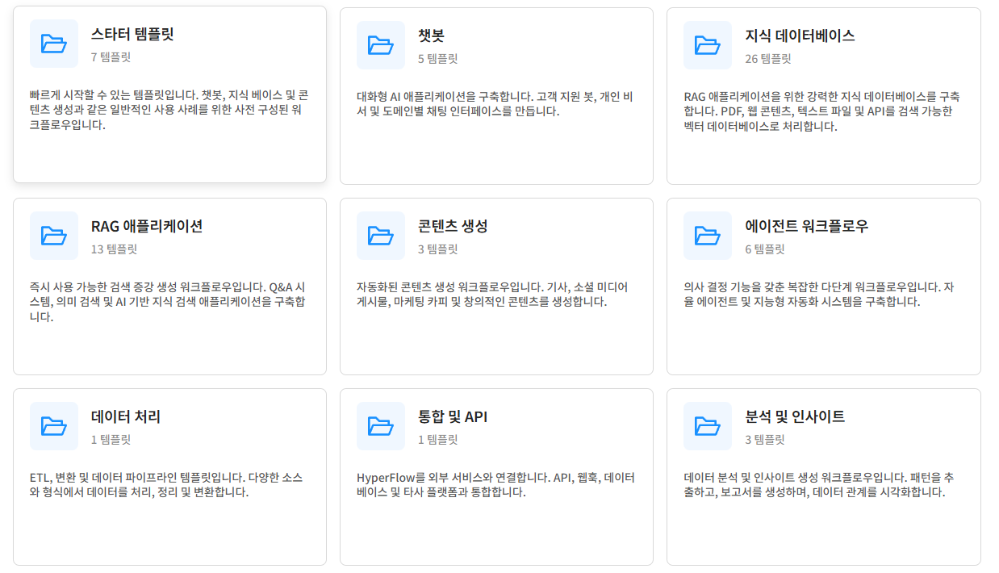

---

# FlowGraph Templete
AI 프로젝트를 시작하기 위한 사전 구축된 템플릿을 탐색하세요

 

[[TOP]](#hyperflow-ai)

---
### 스타터 템플릿
HyperFlow의 가장 인기 있는 사용 사례로 빠르게 시작할 수 있도록 설계된 빠른 시작 템플릿입니다.​

- 개요​
이러한 템플릿은 최소한의 설정으로 사용할 준비가 된 사전 구성된 워크플로우를 제공합니다. 다음에 완벽합니다:​
  - HyperFlow 기능을 탐색하는 처음 사용자​
  - AI 애플리케이션의 신속한 프로토타이핑​
  - 작동하는 예제를 통한 모범 사례 학습​
  - Learning best practices through working examples

- 시작하기​
  - 사용 사례에 맞는 템플릿을 선택하세요​
  - 프로젝트에 복제하세요​
  - 필요에 맞게 구성을 사용자 정의하세요​
  - 워크플로우를 실행하고 반복하세요

 

[[TOP]](#hyperflow-ai)

---
### 기본 챗봇
HyperFlow로 만들 수 있는 가장 간단한 대화형 챗봇입니다. LLM을 통해 최종 사용자와 상호작용하는 더욱 정교한 대화형 챗봇 및 어시스턴트를 개발하는 데 이상적인 출발점입니다.

- **작동 원리**
흐름 그래프는 세 개의 노드를 사용하며, 그 중 두 개는 프로세스 흐름 루프로 연결됩니다.

1. 사용자 입력 노드 → 시작 노드입니다. 사용자 쿼리나 콘텐츠 업로드를 캡처하고(현재 프로젝트의 에셋 스토어에 저장되므로 태그를 한두 개 추가하는 것을 잊지 마세요), 사용자 입력을 해당 노드 User prompt또는 Uploaded content출력 데이터 포트에서 사용할 수 있도록 합니다.   
2. 지침 노드 → 이 노드에서는 챗봇의 성격과 행동을 정의하는 서면 지침을 제공합니다. 이는 일반적으로 "프롬프트 엔지니어링"의 핵심입니다. 프로세스 흐름에 연결되어 있지 않고, "순수 데이터" 노드이며 해당 노드의 출력을 사용하는 노드가 실행될 때 자동으로 실행됩니다.   
3. LLM 노드 호출 → 데이터 포트에 연결된 명령어 Instruction, 포트에 연결된 사용자 프롬프트, User prompt그리고 대화 내역에 대한 이전 LLM 응답으로 구성된 복합 프롬프트를 생성하여 선택한 LLM으로 전송합니다. 편집기 모드에서 노드를 클릭하여 구성 매개변수를 통해 LLM 서비스, 모델 및 모달리티를 선택할 수 있습니다. 이 노드는 별도로 구성하지 않는 한 사용자에게 LLM 응답을 자동으로 표시합니다.   

주요 특징은 다음과 같습니다.

- 프로세스 흐름 루프 : Call LLM의 종료가 User Input의 항목으로 다시 연결되어 대화 주기를 생성합니다.
- 순수 데이터 실행 : Call LLM에 데이터가 필요할 때 Instructions 노드가 자동으로 실행되어 배선이 간소화됩니다.

**데이터 흐름**
- 사용자 프롬프트는 사용자 입력에서 호출 LLM으로 흐릅니다.
- 시스템 지침은 지침 노드에서 호출 LLM으로 흐릅니다.
- Prior responses생성된 응답은 Call LLM 노드의 입력 으로 다시 돌아가 대화 기록을 작성합니다.
- 각 응답은 Call LLM 노드에 의해 자동으로 사용자에게 표시됩니다.

**빠른 사용자 정의**
- 성격 변경 : 지침 노드 텍스트 편집
- 파일 업로드 추가 : 사용자 입력 모드를 "선택적 업로드 + 텍스트 입력"으로 변경
- AI 모델 전환 : LLM 호출 노드에서 다른 모델을 선택하세요
- 프롬프트 제안 추가 : 프롬프트 버튼 노드를 추가하고 사용자 입력 노드 Prompt buttons의 입력 에 연결하여 제안된 프롬프트 버튼을 구성합니다.

**사용 사례**
- 고객 서비스 챗봇
- 교육 Q&A 조수
- 범용 AI 동반자
- 대화형 도움말 시스템
위의 사용 사례 중 일부를 보려면 Starter Chatbots 템플릿의 다른 예를 참조하세요.

**HyperFlow 작업**

 

[[TOP]](#hyperflow-ai)

---