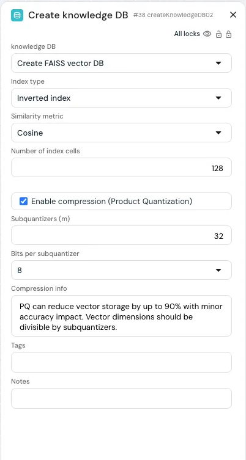
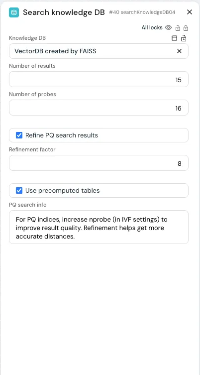

### INDEX

<table>
  <tr>
    <td><a href="./HF릴리스1.0_D01.md">1.릴리스노트</a></td>
    <td><a href="./HF릴리스1.0_D02.md">2.구축및실행</a></td>
    <td><b href="./HF릴리스1.0_D03.md">3.사용가이드</b></td>
    <td><a href="./HF릴리스1.0_D04.md">4.참고용문서</a></td>
    <td><a href="./HF릴리스1.0_D05.md">5.관련리소스</a></td>
  </tr>
</table>

## 3. 사용가이드

- [[3-1.하이퍼플로우 슈퍼 노드 및 서비스 어댑터 사용자 가이드]](#3-1하이퍼플로우-슈퍼-노드-및-서비스-어댑터-사용자-가이드)
- [[3-2.FAISS 벡터 DB 활용을 위한 실전 가이드]](#3-2faiss-벡터-db-활용을-위한-실전-가이드)
- [[3-3.챗봇 스타일링 고급 설정 가이드]](#3-3챗봇-스타일링-고급-설정-가이드)
- [[3-4.프롬프트 템플릿 설정 가이드]](#3-4프롬프트-템플릿-설정-가이드)
- [[3-5.RAG 애플리케이션에서 출처 인용을 지시하는 팁/가이드]](#3-5rag-애플리케이션에서-출처-인용을-지시하는-팁가이드)

---
## 3-2.FAISS 벡터 DB 활용을 위한 실전 가이드
- Sub-Index
  - [개요](#개요)
  - [FAISS 벡터 DB 생성하기](#faiss-벡터-db-생성하기)
  - [FAISS 벡터 DB 검색하기](#faiss-벡터-db-검색하기)
  - [성능 고려사항](#성능-고려사항)
  - [문제 해결 가이드](#문제-해결-가이드)

---
## 소개

HyperFlow에서 제공하는 **FAISS (Facebook AI Similarity Search)** 벡터 데이터베이스 서비스는 임베딩 기반의 **고성능 유사도 검색** 기능을 지원합니다. 이 가이드는 FAISS 벡터 DB를 **생성하고 검색하는 방법**을 중심으로, **대규모 임베딩 모델을 위한 메모리 효율적 접근 방식인 PQ(Product Quantization)** 활용법에 초점을 맞춰 설명합니다.
<!-- 
## Table of Contents

1. [Overview](about:blank#overview)
2. [Creating a FAISS Vector Database](about:blank#creating-a-faiss-vector-database)
    - [Basic Settings](about:blank#basic-settings)
    - [Index Types](about:blank#index-types)
    - [Product Quantization](about:blank#product-quantization)
3. [Searching a FAISS Vector Database](about:blank#searching-a-faiss-vector-database)
    - [Search Parameters](about:blank#search-parameters)
    - [Optimizing PQ Search](about:blank#optimizing-pq-search)
4. [Performance Considerations](about:blank#performance-considerations)
5. [Troubleshooting](about:blank#troubleshooting) 
-->

## 개요

**FAISS**는 고차원 벡터 임베딩에 대한 **효율적인 유사도 검색**을 위해 설계되어, **RAG(Retrieval-Augmented Generation)** 애플리케이션에 특히 적합한 도구입니다. HyperFlow의 FAISS 서비스는 다음과 같은 기능을 제공합니다:

- 다양한 성능 특성에 맞는 **여러 인덱스 타입 지원**
- 메모리를 효율적으로 사용하는 **Product Quantization(PQ)**
- 속도와 정확도의 균형을 조절할 수 있는 **검색 파라미터 설정 기능**
- 컨테이너 환경에 최적화된 **자동 성능 조정 기능**

  

[[TOP]](#index)

---
## FAISS 벡터 DB 생성하기

### 기본 설정

FAISS 벡터 데이터베이스를 생성하려면, 먼저 다음과 같은 **기본 파라미터**를 설정해야 합니다:

| 항목 | 설명 | 권장 |
| --- | --- | --- |
| **인덱스 타입 (Index Type)** | 백터 검색에 사용되는 내부 데이터 구조를 결정합니다. | 백터 수가 10만 미만일 경우: “HNSW”
10만 이상일 경우: “Inverted index” |
| **유사도 기준 (Metric)** | 백터 간 유사도를 계산하는 방식입니다. | 대부분의 LLM 임베딩에는 “Cosine” 권장 |
| **비고 (Notes)** | 해당 벡터 DB에 대한 설명을 기록하는 필드입니다. | 사용한 임베딩 모델, 데이터 출처 등을 함께 기재 |
| **태그 (Tags)** | 백터 DB를 분류하기 위한 라벨입니다. | 필터링이 용이하도록 일관된 네이밍 사용 권장 |

### 인덱스 타입

### Inverted Index (IVF)

벡터가 **10만 개 이상인 대규모 컬렉션**에 적합한 인덱스 방식입니다. 이 방식은 전체 벡터를 여러 **클러스터로 나눠 저장**하여, 검색 속도를 크게 향상시킵니다.

| 항목 | 설명 | 권장 |
| --- | --- | --- |
| **nlist** | 벡터를 나눌 파티션(클러스터)의 개수 | 벡터 개수가 n일 때,  √n 수준으로 설정하는 것이 좋습니다. 예시 :   약 10,000백터 - nlist = 100   약 1000,000벡터 - nlist = 1000 |

### Hierarchical Navigable Small World (HNSW)

**0만 개 미만의 소형~중형 벡터 컬렉션**에 적합한 그래프 기반 인덱스입니다. 빠르고 정확한 검색 성능을 제공하며, 특히 실시간 응답이 중요한 애플리케이션에 유리합니다.

| 항목 | 설명 | 권장 |
| --- | --- | --- |
| **M** | 노드당 최대 연결 수 | 값이 클수록 정확도는 높아지지만, 메모리 사용량도 증가합니다. 32~64 권장. |
| **efConstruction** | 인덱스 생성 품질을 조절하는 파라미터 | 값이 클수록 인덱스 품질은 높아지지만, 생성 속도는 느려집니다. 100~200 권장. |

### Product Quantization

**512차원 이상의 고차원 임베딩**을 사용할 경우, Product Quantization(PQ)을 적용하면 정확도 손실을 최소화하면서 메모리 사용량을 획기적으로 줄일 수 있습니다.

 

**FAISS에 적용 할 PQ 설정 권장값**

| 항목 | 설명 | 권장 |
| --- | --- | --- |
| **압축 활성화   (Enable compression)** | Product Quantization(PQ) 기능의 사용 여부를 설정합니다. | 512차원 이상의 고차원 벡터에 대해 활성화하는 것이 좋습니다. |
| **서브양자화기 수   (Subquantizers, m)** | 벡터를 분할할 세그먼트(서브벡터)의 개수입니다. | 차원 수에 따라 설정:   1500 초과 : 32   768~1500 : 16   768미만 : 8   (반드시 전체 차수의 약수여야 합니다) |
| **서브양자화기당 비트 수   (Bits per subquantizer)** | 양자화 정밀도를 결정합니다 | 일반적으로는 8비트를 사용하며,   16비트는 더 높은 정확도를 제공하지만 압축률은 낮습니다. |
 

**임베딩 차원 수에 따른 권장 설정값**

| 항목 | 설명 | 권장 | 일반적인 압축률 |
| --- | --- | --- | --- |
| OpenAI text-embedding-3-large | 3072 | 32 or 64 | 4-6배 |
| OpenAI text-embedding-3-small | 1536 | 16 or 32 | 4-5배 |
| text-embedding-ada-002 | 1536 | 16 or 32 | 4-5배 |
| Cohere embed-english-v3.0 | 1024 | 16 | 3-4배 |
| MPNet | 768 | 8 or 16 | 3-4배 |
| Sentence Transformers | 384 | 8 | 2-3배 |

> !중요: Subquantizer의 수(m)은 반드시 **임베딩 차원 수의 약수**여야 합니다. 필요한 경우, 시스템에서 이 값을 자동으로 조정합니다.

  

[[TOP]](#index)

---
## FAISS 벡터 DB 검색하기

### 검색 파라미터

FAISS 벡터 DB에서 유사도 검색을 수행할 때는 여러 파라미터를 통해 **검색 속도와 정확도**를 조절할 수 있습니다.

| 항목 | 설명 | 권장 |
| --- | --- | --- |
| **k** | 반환할 결과의 개수 | RAG 애플리케이션의 경우 보통 3~10개 설정 |
| 유사도 기준 (Metric) | 벡터 간 유사도를 계산하는 방식 | 인덱스 생성 시 사용한 방식과 동일해야 함 (일반적으로 Cosine) |

### Inverted Index (IVF)의 경우

| 항목 | 설명 | 권장 |
| --- | --- | --- |
| **nprobe** | 검색 시 조회할 파티션(클러스터)의 개수 | 값이 클수록 (16~64) 검색 정확도(Recall)는 높아지지만, 속도는 느려질 수 있습니다. PQ 인덱스 사용 시 최소 16 이상을  권장합니다. |

### HNSW의 경우

| 항목 | 설명 | 권장 |
| --- | --- | --- |
| **efSearch** | 최종 결과를 추출하기 위해 고려하는 후보 벡터 수 | 값이 클수록 (100-200) 정확도는 향상되지만 검색 속도는 느려질 수 있습니다. |

### PQ 검색 최적화

**Product Quantization(PQ)** 인덱스를 사용할 경우,검색 품질을 높이기 위한 **추가적인 파라미터 설정**이 필요합니다.

 

**PQ를 적용해 FAISS 검색하기**

| 항목 | 설명 | 권장 |
| --- | --- | --- |
| **Refine PQ 검색 결과   (Refine PQ search results)** | 보다 정확한 거리 계산을 활성화합니다. | PQ 인덱스를 사용할 경우 활성화 권장   (정확도 향상) |
| **Refinement factor** | 거리 재계산을 위해 얼마나 많은 후보를 추가로 가져올지 설정합니다. | 고차원 벡터 (>1500): 8-16   중간 차원 벡터: 4-8 |
| **사전 계산된 테이블 사용   (Use precomputed tables)** | PQ 검색 속도를 높이기 위한 최적화 기능입니다. | 기본값 유지 권장   (검색 속도 향상, 메모리 소폭 증가) |
 

**PQ 검색 시 권장 설정:**

- **1024차원 이상의 고차원 벡터**를 사용할 경우,
    
    → 항상 **Refinement 기능을 활성화**하세요.
    
- **PQ 압축이 적용된 IVF 인덱스**에서는
    
    → `nprobe` 값을 **16 이상**으로 설정하는 것이 좋습니다.
    
- *Precomputed tables(사전 계산 테이블)**은
    
    → **성능 향상을 위해 기본값 유지**를 권장합니다.
    
- 검색 정확도가 특히 중요한 경우에는
    
    → `Refinement factor`를 **8 이상**으로 높이세요.
    
  

[[TOP]](#index)

---
## 성능 고려사항

### 메모리 사용량

- **표준 FAISS**: 벡터 하나당 차원 수 × 약 4바이트의 메모리 사용
- **PQ 압축 적용 시**: 보통 차원당 약 1바이트 또는 그 이하로 줄어듦

📌 **예시** (벡터 10만 개 기준):

- 임베딩 모델: `text-embedding-3-small` (1536차원)
- **압축 전**: 약 **600MB**
- **PQ 압축(m=32)** 적용 시: 약 **150MB** → **4배 절감**

---

### 컨테이너 환경 지원

FAISS는 Azure Container Apps, Kubernetes 등 **컨테이너 환경**에서의 안정성을 고려한 기능을 내장하고 있습니다:

- `cgroups`를 통해 컨테이너 메모리 제한을 자동 감지
- 인덱스 로딩 전 메모리 상태를 확인해 **OOM(Out of Memory) 오류를 예방**
- 가능한 경우 **memory-mapped 파일**을 활용하여 메모리 사용량을 줄임
- **인덱스 캐시를 동적으로 관리**해, 여유 메모리를 확보

---

### 인덱스 생성 속도 vs 검색 속도

- **인덱스 생성**: PQ 인덱스는 `m` 값이 높을수록 생성 시간이 더 오래 걸립니다.
- **검색 속도**: PQ 인덱스는 일반적으로 **비압축 인덱스보다 더 빠르게 검색**되며,
    
    특히 **Precomputed Table**을 사용할 경우 성능이 더욱 향상됩니다.
    
  

[[TOP]](#index)

---
## 문제 해결 가이드

### PQ 사용 시 검색 결과가 부정확할 때

PQ 압축 인덱스를 사용했을 때 검색 결과가 좋지 않다면, 다음 항목을 확인해보세요:

1. **Sub-quantizer 수(m)를 늘려보세요**
    - 벡터 차원이 **1536 이상**인 경우, `m=32` 또는 `m=64`를 사용해 보세요.
    - 단, `m`은 **벡터 차수의 약수여야** 합니다.
2. **Refinement 기능을 활성화하고 값을 높이세요**
    - `"Refine PQ 검색 결과"` 옵션을 **활성화**하세요.
    - `Refinement factor`를 **8 이상**으로 설정하세요.
3. **IVF 인덱스의 경우, `nprobe` 값을 높이세요**
    - 최소 `nprobe=16`을 사용하고,
    - 더 높은 정확도가 필요하다면 **32~64** 사이로 설정하세요.
4. **유사도 측정 방식(Metric)이 일치하는지 확인하세요**
    - 인덱스 생성 시 설정한 **Cosine / Inner Product / Euclidean** 방식이
        
        검색 시에도 **동일하게 설정되어야** 합니다.
        

### 메모리 부족 오류 (Out of Memory Errors)

FAISS 사용 중 **메모리 부족 오류(Out of Memory)**가 발생하는 경우, 다음 항목을 확인해보세요:

1. *Product Quantization(PQ)**을 활성화하여 메모리 사용량을 줄이세요.
2. 인덱스를 **생성하거나 검색할 때 배치 크기(batch size)**를 줄이세요.
3. 가능하다면 **컨테이너 메모리 제한**을 상향 조정하세요.
4. 더 가벼운 인덱스 구성이 필요할 경우,
    
    → **`M` 값이 낮은 HNSW 인덱스**를 사용하는 것도 좋은 방법입니다.
    

참고: HyperFlow는 시스템 차원에서 메모리 부족 상태에 빠지지 않도록 감지하고 예방하지만, **적절한 초기 설정또한** 매우 중요합니다.

---

*FAISS 및 벡터 검색 개념에 대한 보다 심화된 내용은 [**FAISS 공식 문서**](https://github.com/facebookresearch/faiss/wiki)를 참고하시기 바랍니다.*

 

[[TOP]](#index)

---