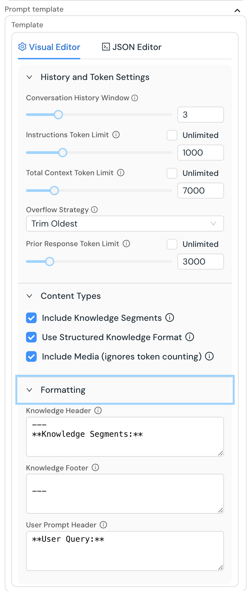

### INDEX

<table>
  <tr>
    <td><a href="./HF릴리스1.0_D01.md">1.릴리스노트</a></td>
    <td><a href="./HF릴리스1.0_D02.md">2.구축및실행</a></td>
    <td><b href="./HF릴리스1.0_D03.md">3.사용가이드</b></td>
    <td><a href="./HF릴리스1.0_D04.md">4.참고용문서</a></td>
    <td><a href="./HF릴리스1.0_D05.md">5.관련리소스</a></td>
  </tr>
</table>

## 3. 사용가이드

- [[3-1.하이퍼플로우 슈퍼 노드 및 서비스 어댑터 사용자 가이드]](#3-1하이퍼플로우-슈퍼-노드-및-서비스-어댑터-사용자-가이드)
- [[3-2.FAISS 벡터 DB 활용을 위한 실전 가이드]](#3-2faiss-벡터-db-활용을-위한-실전-가이드)
- [[3-3.챗봇 스타일링 고급 설정 가이드]](#3-3챗봇-스타일링-고급-설정-가이드)
- [[3-4.프롬프트 템플릿 설정 가이드]](#3-4프롬프트-템플릿-설정-가이드)
- [[3-5.RAG 애플리케이션에서 출처 인용을 지시하는 팁/가이드]](#3-5rag-애플리케이션에서-출처-인용을-지시하는-팁가이드)

---
## 3-4.프롬프트 템플릿 설정 가이드
- Sub-Index
  - []()
  - [프롬프트 이해하기](#프롬프트-이해하기)
  - [프롬프트 템플릿이란?](#프롬프트-템플릿이란)
  - [에디터 개요](#에디터-개요)
  - [비주얼 에디터 기능](#비주얼-에디터-기능)
  - [JSON 에디터: 템플릿 DSL](#json-에디터-템플릿-dsl)
  - [활용 가이드](#활용-가이드)
  - [문제 해결 가이드](#문제-해결-가이드)
  - [고급 기술](#고급-기술)
  - []()
  - []()
  - [마무리](#마무리)

---  
## 소개

프롬프트 템플릿 에디터는 **언어 모델에게 전송되는 프롬프트 내 정보를 어떻게 구성하고 포맷할지 편집할 수 있는 강력한 도구**입니다. 이 가이드는 프롬프트 에디터의 주요 기능을 이해하고, **효과적인 프롬프트를 설계하기 위한 권장 방식**을 소개합니다.


<!--  -->

*시각적으로 편집 가능한 프롬프트 템플릿 에디터 화면*
<br/>

[[TOP]](#index)

---
## 프롬프트 이해하기

특정 도메인이나 전문 분야에 특화된 생성형 AI 애플리케이션에서는, 단순히 사용자의 최신 질문만을 LLM에 전달하는 것만으로는 충분하지 않습니다.

**완성도 높은 프롬프트는 일반적으로 다음과 같은 여러 요소들을 결합**해 구성됩니다:

- AI의 역할과 기능을 정의하는 **시스템 지시문**
- 대화 맥락 유지를 위한 **이전 대화 내역**
- 데이터베이스나 문서에서 가져온 **지식 정보**
- 사용자가 업로드한 파일이나 이미지 같은 **사용자 제공 콘텐츠**
- **현재 사용자 질문**
- 선택적으로 포함되는 **포맷팅 및 구조 지시문**

이처럼 다양한 요소들을 조합해 만든 프롬프트를 **복합 프롬프트(Composite Prompt)**라고 합니다. 이는 LLM이 주어진 작업을 효과적으로 수행할 수 있도록 **정교하게 구성된 프롬프트 조립 구조**이며, **이 프롬프트의 구성 방식과 품질은 AI 응답의 품질에 직접적인 영향을 미칩니다.** 프롬프트 템플릿 에디터를 사용하면 이 복합 프롬프트의 구성 방식을 **정밀하게 제어**할 수 있습니다. 이를 통해 다음과 같은 작업이 가능합니다:

1. 포함할 요소 선택
2. 요소의 **순서와 포맷 정의**
3. 각 섹션별 **토큰 할당량 제어**
4. 대화 내역 및 컨텍스트 유지 방식 설정

## 프롬프트 템플릿이란?

**프롬프트 템플릿**은 다음과 같은 요소들을 제어하는 구성 방식입니다:

- 대화 내역을 어떻게 관리할지
- 어떤 정보를 프롬프트에 포함할지
- 포함된 정보를 어떤 형식과 순서로 구성할지
- 각 섹션에 얼마나 많은 토큰을 할당할지

일반적인 텍스트 템플릿과 달리, **HyperFlow의 프롬프트 템플릿**은 프롬프트의 구조와 구성 방식을 **정밀하게 제어**할 수 있도록 설계되어 있어, 더 효과적인 LLM 상호작용을 구축할 수 있게 해줍니다. 이 템플릿은 시스템이 LLM에 전달할 **복합 프롬프트를 수집하고 구성하는 청사진(blueprint)** 역할을 합니다.
<br/>

[[TOP]](#index)

---
## 에디터 개요

프롬프트 템플릿 에디터는 두 가지 방식으로 템플릿을 수정할 수 있습니다:

1. **비주얼 에디터**: 슬라이더, 체크박스, 텍스트 필드로 구성된 사용자 친화적인 인터페이스
2. **JSON 에디터**: 전체 구조를 직접 제어할 수 있는 코드 기반 편집 모드 (고급 사용자용)

에디터 상단의 탭을 통해 이 두 보기 모드 간에 자유롭게 전환할 수 있습니다.

## 비주얼 에디터 기능

비주얼 에디터는 세 개의 세션으로 구성되어 있습니다:

### 1. 대화 기록 및 토큰 설정

이 섹션에서는 **대화 히스토리 관리**와 **토큰 할당 방식**을 설정할 수 있습니다:

- **대화 기록 창 크기**: 컨텍스트에 포함할 과거 대화(턴)의 개수를 설정합니다.
    - 값이 클수록 더 많은 대화를 기억하지만, 더 많은 토큰을 사용합니다.
    - 일반적인 추천 값: **3~5턴**
- **시스템 지시문 토큰 제한**: 시스템 지시문에 할당할 최대 토큰 수를 설정합니다.
    - “무제한(✔ Unlimited)”을 선택하면 제한 없이 할당됩니다.
    - 추천 범위: **1000~2000 토큰**
- **전체 컨텍스트 토큰 제한**: 전체 프롬프트에 사용할 수 있는 **총 토큰 한도**를 설정합니다.
    - 사용하는 LLM의 컨텍스트 크기에 따라 선택하세요 (예: GPT-4는 8K, Claude는 16K)
    - “무제한(✔ Unlimited)”을 선택하면 가능한 만큼 할당되지만 **비용에 주의**해야 합니다.
- **토큰 초과 처리 방식**: 토큰 한도를 초과했을 때의 처리 방식을 설정합니다.
    - 기본값: **이전 항목부터 제거(Trim Oldest Entries)** – 최근 대화 우선 보존
    - 선택 항목: **균등 분배(Divide Evenly)** – 모든 콘텐츠 유형에 토큰을 고르게 배분
- **이전 응답 토큰 제한**: 대화 내역에 포함될 **AI 응답 내용의 최대 토큰 수**를 설정합니다.
    - 값이 클수록 이전 응답의 맥락을 더 많이 보존할 수 있습니다.
    - “무제한(✔ Unlimited)”으로 설정하면 전체 응답을 모두 포함할 수 있습니다.
    - 일반적 설정: **1000~4000 토큰**, 복잡한 추론에는 **8000 이상** 권장

### 2. 콘텐츠 유형 설정

이 섹션에서는 **프롬프트에 어떤 정보 출처를 포함할지**를 제어할 수 있습니다:

- **지식 세그먼트 포함**: 검색된 지식/컨텍스트를 프롬프트에 포함할지 여부
    - RAG 또는 지식 삽입 기능을 사용할 때 활성화하세요.
- **구조화된 지식 포맷 사용**: 지식 정보를 일관된 형식으로 정리하여 삽입
    - 모델이 정보를 더 잘 인식하고 활용하는 데 도움을 줍니다.
    - 대부분의 사용 사례에서 **활성화를 권장**합니다.
- **미디어 포함**: 업로드된 파일, 이미지 등 미디어 콘텐츠를 포함할지 여부
    - 토큰 계산에는 포함되지 않으며, 전체 파일이나 이미지 자체를 활용할 때 사용합니다.

### 3. 포맷 설정

이 섹션에서는 **프롬프트 내 각 정보 출처의 포맷**을 설정할 수 있습니다:

- **지식 앞머리 텍스트 (Knowledge Header)**: 지식 세그먼트 앞에 삽입할 텍스트
    - 예시: `-\n**Knowledge Segments:**`
- **지식 끝머리 텍스트 (Knowledge Footer)**: 지식 세그먼트 뒤에 삽입할 텍스트
    - 예시: `\n---`
- **사용자 질문 앞머리 텍스트 (User Prompt Header)**: 사용자 질문 앞에 삽입할 텍스트
    - 예시: `*User Query:**`

이러한 헤더와 푸터는 **LLM이 각 정보 블록의 역할을 구분**하는 데 도움이 됩니다.
<br/>

[[TOP]](#index)

---
## JSON 에디터: 템플릿 DSL

**JSON 에디터**는 HyperFlow의 **템플릿 전용 DSL(Domain-Specific Language)**에 직접 접근할 수 있는 강력한 편집 도구입니다. 이 DSL을 활용하면 **복합 프롬프트가 어떻게 구성될지 정확히 정의**할 수 있습니다. 비주얼 에디터는 일반적인 사용 사례를 쉽게 다룰 수 있도록 설계되어 있지만, JSON 에디터를 사용하면 **더 고급스럽고 유연한 템플릿 구성**이 가능해집니다.


*템플릿 DSL 구조를 확인할 수 있는 JSON Editor 화면*

### Template Structure

기본적으로 템플릿은 **객체들의 배열(array of objects)**로 구성되어 있으며, 각 객체는 복합 프롬프트 내의 주요 섹션을 하나씩 나타냅니다. 가장 일반적인 구성 패턴은 다음과 같습니다:

```js
[
  {
    "type": "merged",                         // 하나의 블록으로 합쳐 삽입
    "pathName": "instructions.text",          // 시스템 지시문 위치
    "contextType": "instructions",            // 컨텍스트 유형: 지시문
    "range": "last:1",                        // 최신 항목 1개 사용
    "ignoreTokenLimit": true                  // 토큰 제한 무시
  },
  {
    "type": "interleaved",                    // 여러 블록을 순차적으로 삽입
    "range": "last:5",                        // 전체 구성 중 마지막 5개 범위
    "fields": [
      {
        "pathName": "knowledge",              // 지식 세그먼트 위치
        "contextType": "knowledge",           // 컨텍스트 유형: 지식
        "range": "last:1",                    // 최신 지식 1개 사용
        "header": "---\n**Knowledge Segments:**",  // 시작 부분에 삽입할 텍스트
        "footer": "\n---\n",                  // 끝 부분에 삽입할 텍스트
        "structured": true                    // 구조화된 형식으로 출력
      },
      {
        "pathName": "prompt.text",            // 사용자 입력 위치
        "contextType": "user",                // 컨텍스트 유형: 사용자
        "header": "**User Query:**"           // 앞머리 텍스트
      },
      {
        "pathName": "generation.text",        // 생성된 응답 위치
        "contextType": "generator",           // 컨텍스트 유형: 생성기
        "maxTokens": 3000                     // 최대 토큰 수 제한
      }
    ],
    "maxTokens": 9000                         // 이 전체 블록에 대한 토큰 제한
  }
]
```

### Call LLM 노드의 입력 포트

템플릿 DSL에서 사용되는 `pathName` 값은 Call LLM 노드의 입력 포트와 일치합니다. 이 연결 방식을 이해하면, 프롬프트 탬플릿에 데이터가 어떻게 흘러들어오는지를 명확하게 파악할 수 있습니다.

| pathName | 플로우 그래프 UI 라벨 | 타입 | 설명 |
| --- | --- | --- | --- |
| `instructions.text` | Instructions | text | LLM의 동작을 지시하는 시스템 지시문 |
| `prompt.text` | User prompt | text | 현재 사용자의 질문 |
| `knowledge` | Knowledge | knowledge | 지식 베이스 또는 RAG에서 가져온 정보 |
| `prior.knowledge` | Prior knowledge | knowledge | 대화 흐름과 관련된 과거의 지식 |
| `content` | Content | content | 업로드된 파일이나 이미지 등 미디어 콘텐츠 |
| `generation.text` | Prior responses | text | LLM이 이전에 생성한 응답 내용 |
| `tools` | Tools | tools | 함수 호출용 도구 정의 |
| `toolOutputs` | (Hidden) | toolOutput | 도구 실행 결과 (LLM으로 다시 전달됨) |

템플릿을 설계할 때, 위에 나열된 **입력 항목들을 `pathName`으로 참조하여** 복합 프롬프트에 포함시킬 수 있습니다. 템플릿은 이러한 입력 값들이 **어떤 형식으로, 어떤 순서로, 얼마나 많은 토큰을 사용해** 최종 프롬프트에 포함될지를 제어합니다.

### 섹션 유형

템플릿 DSL에서는 두 가지 주요 섹션 유형을 지원합니다:

### 1. 통합 섹션 (Merged Sections)

**통합 섹션**은 히스토리에서 일치하는 모든 항목을 **하나의 블록으로 모아 삽입**합니다. 보통 프롬프트의 가장 앞부분에 한 번만 나타나는 **시스템 지시문(instructions)**에 자주 사용됩니다.

```js
{
  "type": "merged",                    // 섹션 유형: 통합 섹션
  "pathName": "instructions.text",     // 포함할 데이터: 시스템 지시문 텍스트
  "contextType": "instructions",       // 컨텍스트 유형: instructions
  "range": "last:1",                   // 가장 최근의 1개 항목 사용
  "ignoreTokenLimit": true             // 토큰 제한 무시 (전체 내용을 포함)
}
```

이 섹션은 처리될 때 **모든 지시문 텍스트를 모아**, **복합 프롬프트의 가장 앞부분에 삽입합니다**.

### 2. Interleaved Sections

**교차 섹션**은 대화 흐름을 그대로 유지하면서, **대화 중 실제 발생한 순서에 따라 서로 다른 콘텐츠 유형들을 교차 삽입**합니다. 이 방식은 **순서가 중요한 대화 기록(history)**에 특히 적합합니다.

```js
{
  "type": "interleaved",       // 섹션 유형: 교차(interleaved) 삽입
  "range": "last:5",           // 대화 히스토리에서 최근 5개 턴 사용
  "maxTokens": 9000,           // 이 섹션에 할당할 최대 토큰 수
  "fields": [
    // 교차 삽입할 콘텐츠 유형들을 여기에 정의
  ]
}
```

`fields` 배열은 어떤 콘텐츠 유형을 포함할지, 그리고 어떤 방식으로 삽입할지를 정의합니다. 각 필드는 대화 리스토리의 각 턴마다 순서대로 처리되며, 이를 통해 자연스러운 대화 흐름이 유지됩니다.

### 주요 DSL 속성

템플릿 DSL에서는 다음과 같은 핵심 속성들을 지원합니다:

- **type**: 해당 섹션의 동작 방식을 정의합니다.
    - `"merged"`: 일치하는 모든 콘텐츠를 하나의 블록으로 합침 *(= 통합 섹션)*
    - `"interleaved"`: 서로 다른 콘텐츠 유형을 **발생 순서대로 교차 삽입** *(= 교차 섹션)*
- **pathName**: 사용할 데이터 소스를 지정하며, HyperFlow의 데이터 흐름 경로를 참조합니다.
    - `"instructions.text"`: 시스템 지시문
    - `"knowledge"`: 검색된 지식 세그먼트
    - `"prompt.text"`: 사용자 질문
    - `"generation.text"`: AI 응답
    - `"content"`: 업로드된 파일 또는 이미지 등 미디어
- **contextType**: 해당 콘텐츠의 **LLM 상에서의 유형**을 지정합니다.
    - `"instructions"`: 시스템의 동작을 정의하는 지시문
    - `"knowledge"`: 검색된 정보 또는 컨텍스트
    - `"user"`: 사용자가 입력한 콘텐츠
    - `"generator"`: AI가 생성한 콘텐츠
- **range**: 포함할 히스토리 범위를 제어하는 구문입니다.
    - `"all"`: 모든 히스토리를 포함
    - `"last:N"`: 최근 N개의 항목만 포함
    - `"first:N"`: 처음 N개의 항목만 포함
- **maxTokens**: 해당 섹션에 사용할 수 있는 최대 토큰 수를 설정합니다.
- **ignoreTokenLimit**: `true`일 경우, 이 섹션은 **토큰 계산에서 제외**됩니다.
- **header / footer**: 콘텐츠 앞뒤에 삽입할 텍스트. **포맷팅 구분자**로 유용합니다.
- **structured**: `true`일 경우, 지식 세그먼트에 **특수 포맷**을 적용합니다 (예: 번호 매김, 구분선 등).
- **overflow**: `maxTokens`를 초과할 경우의 처리 방식을 정의합니다.
    - `"trim-oldest"` (기본값): 가장 최근 항목을 우선 보존하고, 오래된 항목부터 제거
    - `"divide-evenly"`: 전체 콘텐츠 유형에 **토큰을 균등 분배**하여 모든 유형이 포함되도록 보장

### 고급 DSL 기능

템플릿 DSL은 비주얼 에디터에서 제공하지 않는 고급 기능도 지원합니다:

1. 선택적 히스토리 처리:
    
    ```js
    "range": "last:10"           // 최근 항목 10개
    ```
    
    각 콘텐츠 유형별로 얼마나 많은 히스토리를 포함할지 **정밀하게 제어할 수 있습니다.**
    
2. 조건부 포맷 지정:
    
    ```js
    "header": "**Knowledge Segments:**"           // 지식 세그먼트
    ```
    
    조건에 따라 서로 다른 포맷을 적용할 수 있습니다 (지원되는 경우에 한함).
    
3. 콘텐츠 순서 사용자 장의:
Interleaved 섹션 안의 fields 배열 순서를 조정하면, 최종 프롬프트에서 콘텐츠가 삽입되는 정확한 순서를 제어할 수 있습니다.

4. 중첩 구조:
복잡한 애플리케이션에서는 여러 개의 통합 섹션과 교차 섹션을 조합하여, 보다 정교한 프롬프트 구조를 구성할 수 있습니다.
<br/>

[[TOP]](#index)

---
## 활용 가이드

### 기본 가이드라인

1. **기본 템플릿부터 시작하세요**
    기본 제공 템플릿은 대부분의 사용 사례에 잘 작동합니다.
    
2. **필요에 따라 조정하세요**    
    프로젝트 목적과 요구사항에 맞게 설정을 수정하세요.
    
3. **실제 질문으로 테스트하세요**
    사용자 쿼리를 기반으로 템플릿을 항상 실제 상황에서 검증하세요.
    
<br/>

[[TOP]](#index)

---
### 토큰 사용 최적화

1. **대화 기록과 지식 간 균형 유지**
    대화 히스토리를 많이 포함할수록, 지식을 담을 수 있는 공간은 줄어듭니다.
    
2. **모델의 컨텍스트 한계를 고려**
    템플릿이 사용 중인 LLM의 컨텍스트 창 크기를 초과하지 않도록 주의하세요.
    
3. **무제한 토큰 옵션은 신중하게 사용**
    비용이 급증할 수 있으므로 꼭 필요한 경우에만 사용하세요.
    

---

### 포맷팅 팁

1. **헤더/푸터에 마크다운을 활용하세요**
    마크다운 형식을 사용하면 LLM이 섹션 구분을 더 잘 이해할 수 있습니다.
    
2. **헤더는 간결하게 작성하세요**
    너무 길지 않되, 각 섹션의 의미가 명확하게 드러나야 합니다.
    
3. **구조화된 지식 포맷을 사용하세요**
    항상 활성화하는 것을 권장하며, 지식 활용 효과가 크게 향상됩니다.
    

### 이용 사례 별 권장 템플릿 설정

| 사용 사례 | 권장 세팅 |
| --- | --- |
| 간단한 챗봇 | 기본 템플릿 사용, 대화 기록 3~5턴 포함 |
| RAG 기반 응용 | 지식 세그먼트 활성화, 구조화 형식 사용, 대화 기록은 2~3턴으로 축소 |
| 장문 생성 (예 : 리포트) | 이전 응답 토큰 제한을 8000 이상으로 증가, 대화 기록은 1~2턴으로 축소 |
| 복잡한 추론 작업 | 시스템 지시문 토큰 수 증가, 지식 포맷을 신중하게 구성 |
<br/>

[[TOP]](#index)

---
## 문제 해결 가이드

- **템플릿이 적용되지 않음**
    변경사항은 자동으로 적용되며, 적용되지 않을 경우 **탭을 한번 전환해보세요.**
    
- **LLM이 지식을 무시함**
    지식 세그먼트의 **헤더 문구를 더 눈에 띄게 조정**해보세요.
    
- **이전 대화 맥락이 잘려나감**
    **이전 응답 토큰 제한(Prior Response Token Limit)**을 높여보세요.
    
- **컨텍스트 창 초과 오류**
    **대화 기록(turns)** 수를 줄이거나, 각 섹션의 **토큰 제한을 조정**해보세요.
    
- **프롬프트 내 콘텐츠 불균형**
    Overflow 설정을 `"trim-oldest"`에서 `"divide-evenly"`로 바꾸면
    **모든 콘텐츠 유형이 고르게 포함될 수 있습니다.**
    
<br/>

[[TOP]](#index)

---
## 고급 기술

### 사용자 정의 헤더와 푸터

각 섹션을 어떻게 활용해야 하는지에 대해 **LLM에게 명확한 지침을 줄 수 있도록**,

사용자 정의 헤더와 푸터를 설정할 수 있습니다.

```
---
KNOWLEDGE CONTEXT (use these facts to answer the question):

[해석]
---
지식 컨텍스트 (이 정보를 바탕으로 질문에 답하세요):
```

### 토큰 분배 전략

최적의 결과를 위해, 아래와 같은 **토큰 분배 비율**을 고려해보세요:

- **15~20%** → 시스템 지시문 (Instructions)
- **30~40%** → 지식 / 컨텍스트 (Knowledge / Context)
- **10~15%** → 사용자 입력 (대화 히스토리 내 질문)
- **20~30%** → 이전 AI 응답 (Prior Responses)

---

### 멀티턴 대화 설계

챗봇을 설계할 때는 아래와 같은 설정을 고려해보세요:

- **3~5턴의 대화 히스토리**: 일반적인 대화 흐름에 적합
- **이전 응답 토큰 제한 무제한**: 대화 맥락을 더욱 완전하게 유지
- **구조화된 지식 포맷**: 턴 간 일관된 정보 전달에 효과적

## 템플릿 동작 확인하기

설계한 템플릿이 적용된 **플로우그래프를 실행하면**, **Run Session Log**에서 최종 복합 프롬프트가 어떻게 구성되었는지 직접 확인할 수 있습니다. 이를 통해 템플릿 설정이 **정상적으로 작동하는지 검증**하고, **각 구성 요소가 어떤 방식으로 조합되는지 시각적으로 이해**할 수 있습니다.

*Run Session Log 내의 Composite Prompt 뷰에서는 템플릿 요소들이 실제로 어떻게 조립되었는지 확인할 수 있습니다.*


### 복합 프롬프트 보기 이해하기

**Composite Prompt** 섹션에서는 LLM에게 전달되는 최종 프롬프트의 구성 요소를 테이블 형식으로 보여줍니다:

1. **Type 열**: 각 항목의 컨텍스트 유형을 나타냅니다 (예: instructions, knowledge, user, generator)
2. **Content 열**: LLM에 실제로 전달되는 콘텐츠를 표시합니다
3. **예상 토큰 수 (Approx. Tokens)**: 각 항목이 사용하는 토큰 수의 추정값을 표시합니다
4. **Source Step**: 해당 콘텐츠가 대화 히스토리 내 어느 단계에서 추출되었는지를 나타냅니다

위 예시에서 확인할 수 있는 구성은 다음과 같습니다:

- **지시문 (row 1)**: 템플릿 내 `"merged"` 섹션에 따라 프롬프트의 가장 앞에 배치됨
- **지식 (row 2)**: 지정된 헤더/푸터와 함께 포맷된 검색된 지식 세그먼트
- **사용자 질문 (rows 3 and 5)**: 템플릿 설정에 따라 포맷된 사용자 입력
- **AI 응답 (row 4)**: 이전 LLM 응답이 대화 맥락의 일부로 포함됨

이 뷰를 통해 다음 사항을 시각적으로 이해할 수 있습니다:

- 토큰이 어떻게 분배되고 사용되는지
- 콘텐츠가 어떤 순서로 구성되는지
- 대화 히스토리가 어떻게 반영되는지
- 지식 세그먼트가 정확히 포함되고 있는지

---

### 결과 기반 최적화

Composite Prompt 뷰를 확인하며, 다음과 같은 방식으로 템플릿을 개선할 수 있습니다:

1. **토큰 사용량이 예상보다 많을 경우** → 각 섹션의 토큰 제한 값을 줄이세요
2. **일부 콘텐츠가 누락되는 경우** → 해당 콘텐츠의 포함 여부 설정을 확인하세요
3. **포맷이 이상하게 보일 경우** → 헤더/푸터 설정을 점검하고 조정하세요
4. **대화 맥락이 충분히 유지되지 않을 경우** → 히스토리 윈도우 값을 늘리세요

이와 같은 **피드백 루프**는 효과적인 프롬프트 엔지니어링에 핵심적인 요소입니다.
<br/>

[[TOP]](#index)

---
## 마무리

**Prompt Template Editor**는 LLM에게 전달되는 정보의 형식과 구조를 세밀하게 제어할 수 있도록 도와줍니다. 비주얼 에디터를 활용하면 JSON을 직접 수정하지 않고도 주요 설정을 빠르게 조정할 수 있으며, 복잡한 요구사항에는 JSON 에디터를 통해 완전한 유연성을 확보할 수 있습니다. 프롬프트 엔지니어링은 **과학이자 예술**입니다. 다양한 설정을 실험해보며 귀하의 사용 사례에 최적화된 구성을 찾아보세요. 그리고 **Run Session Log**를 활용해 템플릿의 작동 방식을 꼼꼼히 검증하는 습관을 가지세요.

---

※ 참고: 토큰 수는 `cl100k_base` 토크나이저 기준의 **예상값**이며, 실제 사용량은 사용하는 LLM과 콘텐츠에 따라 달라질 수 있습니다.

<br/>

[[TOP]](#index)

---