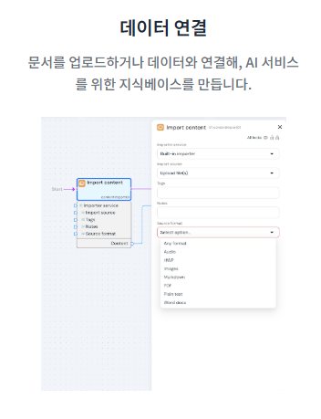
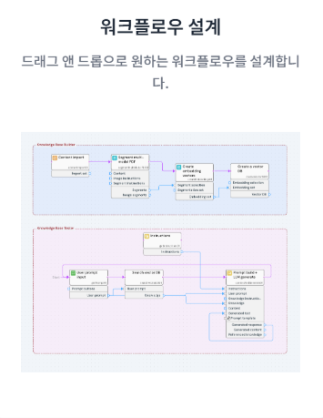

# HyperFlow 애플리케이션 개발

<table>
  <tr align="center">
    <td> Step1 </td>
    <td> Step2 </td>
    <td> Step3 </td>
  </tr>
  <tr align="center">
    <td>  </td>
    <td>  </td>
    <td>  </td>
  </tr>
</table>